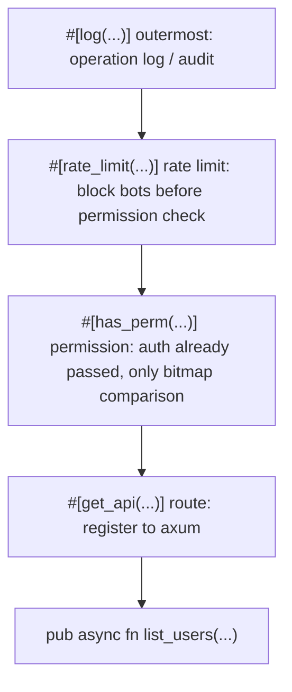

# Why I Fell in Love with Rust Macros

> From `#[has_perm]` to `#[log]` — what writing an admin with macros actually feels like, plus a few half-baked opinions on Rust's macro system.

If you came from the Java/Spring annotation world like I did, Rust's proc-macros will feel both familiar and alien at the same time.

The familiar part: "slap on an attribute and you get a behavior."

The alien part: Rust macros **emit code at compile time** — no runtime reflection, no lookup tables.

This post covers three things:

1. The full roster of macros in `summerrs-admin`
2. How macros compare to Java annotations, Python decorators, C# Attributes, and C++ macros
3. Why I went from "I don't get why people use these" to "I want four layers on every handler"

## 0. The TL;DR

The **actual** router in the main repo looks like this (verbatim from `crates/summer-system/src/router/sys_notice.rs`):

```rust
#[log(module = "系统公告", action = "创建", biz_type = Create)]
#[post_api("/notice")]
pub async fn create(
    LoginUser { profile, .. }: LoginUser,
    Component(svc): Component<SysNoticeService>,
    ValidatedJson(dto): ValidatedJson<CreateNoticeDto>,
) -> ApiResult<()> {
    svc.create(dto, &profile.nick_name).await?;
    Ok(())
}
```

Two attribute macros + handler. But the macro crate can give you up to 4 layers — add the not-yet-ubiquitous `#[has_perm]` and `#[rate_limit]`, and the **ideal state** looks like this:

```rust
#[log(module = "系统公告", action = "创建", biz_type = Create)]
#[rate_limit(rate = 5, per = "second", key = "user")]
#[has_perm("system:notice:add")]
#[post_api("/notice")]
pub async fn create(
    LoginUser { profile, .. }: LoginUser,
    Component(svc): Component<SysNoticeService>,
    ValidatedJson(dto): ValidatedJson<CreateNoticeDto>,
) -> ApiResult<()> {
    svc.create(dto, &profile.nick_name).await?;
    Ok(())
}
```

Four lines of attribute macros, two lines of business logic. The capabilities this ideal state provides:

- **Routing**: `#[post_api("/notice")]` registers via `inventory` into the `summer-system` group → `router_with_layers()` collects all handlers in the group and attaches a JWT layer → `crates/app/src/router.rs` `nest("/api", ...)` assembles the final `POST /api/notice`
- **Permission check**: No `system:notice:add` permission → 403; wildcard `system:*` also works
- **Rate limiting**: Max 5 requests per second per logged-in user, excess → 429
- **Operation log**: Request params, response, duration, operator — all written asynchronously to `sys_operation_log`; panics are caught too

> **Current status**: `#[log]` is fully rolled out across the main repo — over a dozen routers use it. `#[has_perm]` and `#[rate_limit]` are fully implemented (both have unit tests), but **not yet wired up in the main repo's routers** — `job_router.rs` even has a comment at the top saying "permission check not wired during dev, must add before go-live." The "standard package" discussed below refers to the state after full rollout, not current production code.

Note that I didn't mention "authentication" — **authentication is not the macro's job**, it's middleware's job. The next section covers this distinction in detail.

## 1. Life Without Macros

The earliest version of a handler, assuming the auth middleware has already injected `LoginUser` into request extensions (more on that later), still had a long checklist:

```rust
pub async fn list_users(
    login_user: LoginUser,
    Query(query): Query<PageQuery>,
    Component(svc): Component<SysUserService>,
    Component(log_svc): Component<OperationLogService>,
    method: Method,
    uri: Uri,
    ClientIp(ip): ClientIp,
) -> ApiResult<Json<PageResult<UserVo>>> {
    // —— 1. Permission ——
    if !login_user.has_perm("system:user:list") {
        return Err(ApiErrors::Forbidden);
    }

    // —— 2. Rate limit (hand-rolled in-memory version) ——
    let rate_key = format!("user:{}", login_user.login_id);
    if !RATE_LIMITER.check(&rate_key, 10, Duration::from_secs(1)) {
        return Err(ApiErrors::TooManyRequests);
    }

    // —— 3. Operation log: start timer ——
    let started = Instant::now();
    let req_params = serde_json::to_string(&query).ok();

    // —— 4. Business logic ——
    let result = svc.page(query).await;

    // —— 5. Operation log: write entry ——
    let log_entry = OperationLog {
        login_id: login_user.login_id,
        module: "用户管理".into(),
        action: "列表查询".into(),
        biz_type: BizType::Query,
        method: method.to_string(),
        uri: uri.to_string(),
        ip: ip.to_string(),
        params: req_params,
        response: result.as_ref().ok().and_then(|r| serde_json::to_string(r).ok()),
        duration_ms: started.elapsed().as_millis() as i64,
        status: if result.is_ok() { LogStatus::Success } else { LogStatus::Failed },
        ..Default::default()
    };
    tokio::spawn(async move {
        if let Err(e) = log_svc.insert(log_entry).await {
            tracing::warn!("写操作日志失败: {e:?}");
        }
    });

    result.map(Json)
}
```

**50+ lines of code, and the business logic is just `svc.page(query).await`.**

What's worse: every handler had to repeat this. By the 5th copy-paste, I started thinking about extracting it into middleware. But axum middleware can only handle "pre" and "post" logic — **cross-cutting concerns that span the entire handler lifecycle, like "I need the handler's return value for logging", are beyond what middleware can easily touch** — to get the response body you'd have to buffer the entire body (breaking streaming) or parse axum's internal types.

By the 8th handler, I decided to write macros.

## 2. Auth vs Permission: Macros Don't Decide "Who Gets In", Only "What They Can Do"

Before diving into macros, this boundary must be clear — **authentication (who gets in) is middleware's job; authorization (what the person can do) is the macro's job**.

### The authentication pipeline: entirely in `summer-auth` middleware

Between the request arriving and the handler running, it goes through this layer:

```mermaid
flowchart LR
    Req["HTTP Request"] --> GAL["GroupAuthLayer Tower Layer"]
    GAL --> Strat["JwtStrategy.authenticate"]
    Strat --> PAC{"PathAuthConfig include match?"}
    PAC -->|No match (exempt)| H["handler"]
    PAC -->|Match| Verify["Parse + verify JWT"]
    Verify -->|Failure| E401["401"]
    Verify -->|Success| Inj["Inject LoginUser into request extension"]
    Inj --> H
```

Three key components:

- **`GroupAuthLayer`** (`crates/summer-auth/src/group_layer.rs`) — a Tower Layer that wraps `GroupAuthStrategy` into an axum middleware
- **`JwtStrategy`** (`crates/summer-auth/src/jwt_strategy.rs`) — implements `GroupAuthStrategy`; parses `Authorization: Bearer ...`, verifies signature/expiry, assembles `LoginUser`
- **`PathAuthConfig`** (`crates/summer-auth/src/path_auth.rs`) — path policy table: `include` lists patterns requiring auth, `exclude` lists exempt patterns

At startup, the admin domain is roughly configured like this:

```rust
let cfg = PathAuthConfig::new()
    .include("/api/admin/**")                                  // default: all need auth
    .exclude_method(MethodTag::Post, "/api/admin/auth/login")  // login endpoint exempt
    .extend_excludes_from_public_routes("summer-system");      // batch pull in #[public] routes
```

Note the third line — `#[public]` / `#[no_auth]` macros don't "turn off auth themselves." They **use `inventory::submit!` to register route info into a global table**, and at startup `PathAuthConfig` actively pulls this table and merges it into `exclude`.
**What actually decides "who gets in" is `PathAuthConfig`; the macro is just the declaration mechanism**.

### So is `#[login]` still useful?

Strictly speaking, it's redundant right now.

All admin routes are already covered by `include("/api/admin/**")`, so passing the middleware means you can **directly destructure `LoginUser` as a function parameter**:

```rust
#[get_api("/profile")]
pub async fn get_profile(
    LoginUser { login_id, .. }: LoginUser,        // ← use directly, no macro needed
    Component(svc): Component<UserService>,
) -> ApiResult<Json<UserProfile>> { ... }
```

Then why do we keep `#[login]`? **As a second-level safety net for `PathAuthConfig` wildcards.**
`PathAuthConfig` uses **wildcard** `include("/api/admin/**")` / `exclude("/xxx/**")` matching, so the granularity is inevitably coarse — some endpoints might be **accidentally exempted** by wildcards (middleware skips auth), but the handler itself actually requires login. That's where `#[login]` comes in: its expansion is equivalent to inserting `_: LoginUser` into the parameter list, and `LoginUser::from_request_parts` tries to get `UserSession` from request extensions — **if it's not there, it returns 401 directly** — the same as not using the macro and destructuring `LoginUser` directly, but the attribute form makes "this endpoint requires login" more visually prominent.

In short: **when wildcards aren't granular enough, `#[login]` is the handler-level switch that demands login**.

### Permission / rate-limit / logging: middleware can do it, macros do it better

To be clear — middleware **can** do all three of these. axum's `from_fn_with_state` supports parameterized middleware, so you can absolutely attach a layer carrying "required permission code / rate limit quota / log metadata" to each route:

```rust
// Completely viable middleware approach
Router::new()
    .route("/users", get(list_users).layer(RequirePerm::new("system:user:list")))
    .route("/users", post(create_user).layer(RequirePerm::new("system:user:add")))
```

So why do we use macros? **Expressiveness + maintenance cost**:

| Dimension | Middleware | Macro |
|---|---|---|
| **Declaration location** | Cross-file — mental mapping between route assembly and handler | **Same place** as handler; declaration = implementation |
| **Rewriting function body** | Can only intercept before/after; can't inject code into the function body | Can rewrite the entire function body (`#[log]`'s `catch_unwind` wrapper is a prime example) |
| **Stacking policies** | Execution order of multiple layers depends on `Router` assembly order | Attribute stacking order is immediately visible |
| **Per-route boilerplate** | Each route needs a repeated layer call | One attribute line |

In other words, these three things are **not "impossible with middleware"** — macros just make them more compact and make the handler's "constraint surface" more visible. The rest of "why I love them" is about this angle — it's not that macros have exclusive capabilities, but that they lower the cost.

## 3. The Full Roster: 10 Attribute Macros

`crates/summer-admin-macros/` currently contains 10 `#[proc_macro_attribute]`s, in four categories:

| Category | Macros | Count |
|---|---|---|
| Auth | `#[login]` `#[public]` `#[no_auth]` `#[has_perm]` `#[has_role]` `#[has_perms]` `#[has_roles]` | 7 |
| Operation log | `#[log]` | 1 |
| Rate limiting | `#[rate_limit]` | 1 |
| Job scheduling | `#[job_handler]` | 1 |

Details below, grouped by category.

### 3.1 Auth (7 macros)

#### `#[login]` — second-level safety net for PathAuthConfig wildcards

As described in Section 2, auth is handled by the `PathAuthConfig` + `JwtStrategy` middleware layer. But `PathAuthConfig` uses wildcard matching, **so the granularity may not be fine enough** — when some endpoints are accidentally exempted by wildcards and the handler itself needs login, `#[login]` provides a second-level safety net at the handler layer. Its expansion is equivalent to inserting `_: LoginUser` in the parameter list; the extractor tries to get `UserSession` from extensions and returns 401 if not found.

#### `#[public]` / `#[no_auth]` — auth exemption (identical aliases)

Registers the current route into the global `public_routes` table via `inventory::submit!`, which gets pulled into `exclude` at startup by `PathAuthConfig.extend_excludes_from_public_routes(group)`.

```rust
// Auto mode: derive method + path from the route macro below
#[public]
#[get_api("/health")]
pub async fn health_check() -> ApiResult<()> { Ok(()) }

// Manual: method + path
#[public(GET, "/legacy/endpoint")]
#[get_api("/legacy/endpoint")]
pub async fn legacy() -> ApiResult<()> { Ok(()) }

// Cross-crate group reuse
#[public(group = "summer-system")]
#[get_api("/status")]
pub async fn status() -> ApiResult<()> { Ok(()) }
```

Registration isn't runtime vec-pushing — it's `inventory::submit!` at compile time, **collected once at process startup**. Zero runtime registration overhead.

#### `#[has_perm("perm")]` — single permission

```rust
#[has_perm("system:user:list")]
#[get_api("/system/user/list")]
pub async fn list_users(...) -> ApiResult<...> { ... }
```

Expansion does two things:

1. Injects `__auth_guard: LoginUser` before the parameters (retrieved from the extension the middleware already placed)
2. At the function body's start, checks the permission; insufficient → `return Err(Forbidden)`

Supports `*` wildcard: `system:*` matches `system:user:list`, `system:role:list`, etc.

> **One more clarification**: `#[has_perm]` doesn't do authentication itself — it only does **string wildcard matching** — the expansion is just `__auth_guard.permissions().iter().any(|p| permission_matches(p, "system:user:list"))`. Authentication was already completed at the middleware layer — by this point `LoginUser` is already in the extensions.
>
> **The bitmap (`bitmap.rs`) is only for compressing the permission list into JWT/Redis** — `encode` turns `Vec<String>` into a base64 bitmap for storage savings; on retrieval, `decode` converts back to `Vec<String>` for matching. **The bitmap does NOT participate in "faster comparison"** — wildcards (`system:*` matching `system:user:list`) make O(1) bit AND impossible; comparison still uses string paths.

#### `#[has_role("role")]` — single role

Same structure as `has_perm`, exact match, no wildcards.

#### `#[has_perms(and(...))]` / `#[has_perms(or(...))]` — multiple permissions

```rust
// Must have both
#[has_perms(and("system:user:list", "system:user:add"))]
#[post_api("/system/user")]
pub async fn create_user(...) -> ApiResult<()> { ... }

// Any one suffices
#[has_perms(or("system:user:list", "system:role:list"))]
#[get_api("/overview")]
pub async fn overview(...) -> ApiResult<...> { ... }
```

#### `#[has_roles(and(...))]` / `#[has_roles(or(...))]` — multiple roles

Same pattern, no examples needed.

> **Hidden gotcha**: `#[login]` and `#[has_perm]` both inject `LoginUser` into the parameter list — **stacking both gives you two extractors of the same type**, and axum won't compile. In practice, `#[has_perm]` alone is enough — don't add `#[login]` on top.

### 3.2 Operation Log: `#[log]`

```rust
#[log(module = "菜单管理", action = "获取菜单树", biz_type = Query)]
#[get_api("/v3/system/menus")]
pub async fn get_menu_tree(
    LoginUser { login_id, .. }: LoginUser,
    Component(svc): Component<SysMenuService>,
) -> ApiResult<Json<Vec<MenuTreeVo>>> { ... }
```

**This is the longest macro** (`log_macro.rs` 746 lines), because it has the most work to do:

1. Injects an `OperationLogContext` extractor (bundles Method, Uri, HeaderMap, ClientIp, LoginId, Service)
2. Wraps the function body with `AssertUnwindSafe(async { ... }).catch_unwind().await` — catches both business `Err` **and panics**
3. Infers status (Success / Failed / Exception) and HTTP status code from the result
4. `tokio::spawn` async write to `sys_operation_log` — **doesn't block the response**
5. On panic, `resume_unwind` re-throws the original panic, preserving axum's panic handling chain

Parameters:

| Param | Required | Default | Description |
|---|---|---|---|
| `module` | Y | — | Business module |
| `action` | Y | — | Operation description |
| `biz_type` | Y | — | `Other / Create / Update / Delete / Query / Export / Import / Auth` |
| `save_params` | N | `true` | Set `false` for sensitive endpoints (e.g., don't log passwords on login) |
| `save_response` | N | `true` | |

Sensitive endpoint example:

```rust
#[log(module = "认证管理", action = "用户登录", biz_type = Auth, save_params = false)]
#[post_api("/auth/login")]
pub async fn login(...) -> ApiResult<Json<LoginVo>> { ... }
```

**A small bonus**: the macro also maintains the function's doc comments — when there's no doc, it uses `action` as the summary and auto-appends `@tag {module}`, which syncs directly with OpenAPI tooling.

### 3.3 Rate Limiting: `#[rate_limit]`

```rust
// Single IP, 2 requests per second
#[rate_limit(rate = 2, per = "second", key = "ip")]
#[get_api("/limited")]
async fn limited_handler() -> ApiResult<()> { Ok(()) }
```

Has more parameters than `#[log]`, but the defaults are sensible:

| Param | Required | Default | Description |
|---|:---:|---|---|
| `rate` | Y | — | Requests per window; must be > 0 |
| `per` | Y | — | `"second" / "minute" / "hour" / "day"` |
| `key` | N | `"global"` | Dimension: `global / ip / user / header:<name>` |
| `backend` | N | `"memory"` | `memory / redis` |
| `algorithm` | N | `"token_bucket"` | 6 algorithms, see table below |
| `failure_policy` | N | `"fail_open"` | When Redis is down: `fail_open / fail_closed / fallback_memory` |
| `burst` | N | = `rate` | Burst capacity; **only `token_bucket` / `gcra` accept it**, others will fail at compile time |
| `max_wait_ms` | N | — | Max queue wait in ms; **only `throttle_queue` requires it and it must be > 0** |
| `mode` | N | `"enforce"` | `enforce / shadow` (shadow = record but don't block) |
| `message` | N | `"请求过于频繁"` | Error message when rate limit is hit |

Six algorithms: `token_bucket / gcra / fixed_window / sliding_window / leaky_bucket / throttle_queue`. (`throttle_queue` also accepts `queue` / `throttle` as aliases.)
Violating "which algorithm accepts which parameter" constraints gets caught at the `parse_macro_input!` stage — e.g., `#[rate_limit(... algorithm = "fixed_window", burst = 10)]` fails at compile time. This is the type-safety benefit of macros (see 6.3).

**Shadow mode** saved me once: ran a new rate limit rule in shadow mode for a week before enforcing, checked stats to see "how many would have been blocked if enforcing", discovered the rule was too tight, adjusted before it affected production.

### 3.4 Job Scheduling: `#[job_handler]`

```rust
#[job_handler("summer_system::s3_multipart_cleanup")]
async fn s3_multipart_cleanup(ctx: JobContext) -> JobResult {
    let s3: aws_sdk_s3::Client = ctx.component();
    let config = ctx.config::<S3Config>()?;
    // ...
    Ok(serde_json::json!({"aborted": 0}))
}
```

What the macro does:

1. Preserves the original `async fn`
2. Generates an internal wrapper that converts `async fn` into `fn(JobContext) -> Pin<Box<dyn Future + Send>>`
3. `inventory::submit!` registers into `summer_job_dynamic::JobHandlerEntry` (name → fn mapping table)

At startup, `HandlerRegistry::collect()` scans all entries into a table; the scheduler looks up the database's `sys_job.handler` field to find and execute.
**Changing cron, enabling/disabling, manual triggers — all through the database, no recompilation needed**. This is where the "dynamic" in `summer-job-dynamic` comes from.

## 4. What a Complete Handler Looks Like

Stacking everything above, the order matters:



### A few iron rules

1. **`#[log]` must be above the route macro** — it needs to see the unexpanded `*_api` attribute below to validate placement
2. **`#[rate_limit]` must be outside the route macro** — same reason, needs the route macro as an anchor
3. **Auth macros (`#[has_perm]` etc.) go directly above the route macro** — expansion takes over the parameter list
4. **`#[public]` and `#[has_perm]` are mutually exclusive** — one exempts auth, the other requires permissions; logical contradiction
5. **Don't stack multiple auth macros** — `#[login]` + `#[has_perm]` injects `LoginUser` twice; axum won't compile

Remember "**log outermost, rate limit next, permission right above route, route closest to function**" and you won't mess up the order.

## 5. Comparing With Other Languages

Before writing Rust macros, I'd used Java annotations, Python decorators, and TS decorators. I haven't actually written C++ macros, but as the oldest and most widely known "code generation" mechanism, it can't be skipped — so it's included in the comparison too. This section puts them side by side so you can see what makes Rust proc-macros truly "special."

### 5.1 Java/Spring Annotations

```java
@RestController
public class UserController {
    @PreAuthorize("hasRole('ADMIN')")
    @GetMapping("/users")
    public List<User> list() { ... }
}
```

- **Implementation**: runtime reflection + bytecode enhancement (CGLIB / JDK Proxy)
- **Runtime overhead**: every call goes through a proxy object, reflection lookups
- **Type safety**: `@PreAuthorize("hasRole('ADMIN')")` is a SpEL **string** — typo and it blows up at runtime
- **IDE support**: IntelliJ is maxed out — navigation, completion, error highlighting all work

Spring annotations are powerful and the ecosystem is mature, but **paying reflection overhead on every request** is an unchangeable cost.

### 5.2 Python Decorators

```python
@app.route("/users")
@require_login
def list_users():
    ...
```

- **Implementation**: **pure runtime** — decorators are higher-order functions, wrapping the original function and returning a new one
- **Runtime overhead**: every call goes through the wrapper function (a few function pointer jumps)
- **Type safety**: virtually none; type hints are just suggestions for mypy
- **Flexibility**: **highest** — after getting the original function object, you can do anything; even replace it dynamically at runtime

Flexible but **behaviorally unstable**. Swap the order of two decorators and the effect may change completely. Debugging can easily spiral.

### 5.3 TypeScript Decorators (NestJS)

```typescript
@Controller('users')
export class UserController {
  @UseGuards(AuthGuard)
  @Get()
  list() { ... }
}
```

- **Implementation**: **experimental metadata + reflect-metadata** (runtime)
- **Runtime overhead**: NestJS scans metadata once at startup to build a route table, then looks it up at runtime
- **Type safety**: function signatures have types, but metadata is runtime
- **IDE support**: VS Code and IntelliJ both work

TS decorators are cousins of Python's, but because of static typing, the experience is slightly better than Python. Still fundamentally runtime.

### 5.4 C# Attributes + Source Generator

C#'s story is more interesting than the others because it has **two systems side by side**:

```csharp
// Old-school Attribute (runtime reflection, same generation as Java)
[HttpGet("users")]
[Authorize(Roles = "Admin")]
public IActionResult List() { ... }

// C# 9+ Source Generator (compile-time code generation)
[GeneratedRegex("\\d+")]
private static partial Regex DigitRegex();
```

- **Old Attributes**: same deal as Java annotations — runtime reflection + IL weaving
- **Source Generator**: **runs at compile time, generates new C# code that joins the project's compilation** — this is the real counterpart to Rust proc-macros
- **Type safety**: Source Generator output is real C# code; errors caught at compile time
- **Runtime overhead**: Source Generator path has **zero overhead** — identical to hand-written code

The C# team clearly recognized the cost of reflection; Source Generator is about moving "runtime reflection capabilities to compile time." **The philosophy is identical to Rust proc-macros**.

### 5.5 C++ Macros

```cpp
#define LOG(level, msg) \
    do { if (g_log_level >= (level)) std::cerr << (msg) << '\n'; } while (0)

#define MIN(a, b) ((a) < (b) ? (a) : (b))   // classic trap: MIN(i++, j++) increments twice
```

- **Implementation**: **preprocessor** — text substitution, completed before the compiler sees the code
- **Type safety**: **absolutely none** — `#define` knows nothing about types or scope
- **Error reporting**: errors in expanded code all point to the macro invocation; debugging nightmare
- **C++20+ attributes** (`[[nodiscard]]` `[[likely]]`) are a more modern extension, but much weaker than Rust attribute macros
- **C++26 reflection proposal** is in progress; when it ships it'll get closer to Rust macros

C++ macros are the "ancestor", but also the **most dangerous** — text substitution doesn't even know about syntax trees.

### 5.6 Side-by-Side Comparison

| Mechanism | Implementation | Runtime Overhead | Type Safety | IDE Support |
|---|---|:---:|:---:|:---:|
| Java annotations | Runtime reflection | Yes | Weak (SpEL strings) | Strong |
| Python decorators | Runtime HOF | Yes | None | Medium |
| TS decorators (NestJS) | Runtime metadata | Yes | Medium | Strong |
| C# Attributes | Runtime reflection | Yes | Medium | Strong |
| **C# Source Generator** | **Compile-time code generation** | **No** | **Strong** | Medium |
| C++ `#define` | Preprocessor text substitution | No | None | Weak |
| **Rust proc-macros** | **Compile-time AST rewriting** | **No** | **Strong** | Medium (rust-analyzer catching up) |

One-sentence summary: **Rust proc-macros ≈ C# Source Generator's "strictly typed edition" + C++ `#define`'s "AST-safe edition."**
You get decorator-level expressiveness, zero runtime overhead, **plus compile-time type checking** — those three things are rarely available simultaneously in other languages.

## 6. Why I Fell in Love With Macros

Now that the tools and comparisons are done, let me share how it actually feels.

### 6.1 Compile-time completion, zero runtime overhead

`#[has_perm("system:user:list")]` is replaced at compile time with actual Rust code — a direct call to `LoginUser::has_perm`. **The expansion looks identical to hand-written code**; JIT "hotspot optimization" isn't even needed.

I'm not saying "saving those few nanoseconds matters" — I'm saying: **an abstraction layer that doesn't tax you** makes me use it with peace of mind. You can stack four layers of macros freely, knowing the output is just ordinary code.

Compare with Spring's `@PreAuthorize` from 5.1 — stack a few annotations and you pay a few layers of reflection overhead; stack too many and it shows up in the profiler. On the Rust side, four macro layers are free.

### 6.2 Cross-cutting concerns physically adjacent to the handler

"Cross-cutting concerns" is AOP terminology: **logging, permissions, rate limiting are orthogonal to business logic** — they don't belong to any specific business, but every handler needs them.

Section 2 already covered that middleware **can** do these things. But the experience macros give me is: **you don't need to maintain a "route ↔ middleware parameter" mapping in the `Router` assembly** — `#[has_perm("system:user:list")]` is in the same line of sight as the handler; renaming, changing parameters, deleting — all done in one place.

Reading a handler is the same: glance at the attribute zone and the endpoint's "constraints" are immediately visible — permission required? rate limited? how is logging done? — **no need to cross-reference the router file to see which layers are attached**.

What macros have over middleware is the ability to **rewrite the entire function body** — `#[log]`'s `catch_unwind` wrapping. Middleware can catch too (wrapping `Service::call` in a layer), but macros can **fuse more tightly with the function body**: e.g., inserting code at a specific position inside the function body is something only macros can do. Not an everyday need, but when you need it, it's the only way.

### 6.3 Type safety, compile-time errors

Python's `@app.route("/users/<int:id>")` has `<int:id>` as a string — typo and it crashes at runtime.
Rust macros generate real Rust AST — **all errors surface at `cargo build` time**.

`#[has_perms(and("a", "b"))]` — `and` is an argument enum; misspell it as `andd` and it fails to compile; it can never reach production.
`#[rate_limit(algorithm = "token_bukcet")]` — misspelled algorithm name also rejected at the `parse_macro_input!` stage inside the macro.

### 6.4 Declarative beats imperative

The last point is more subjective: **`#[has_perm("system:user:list")]` reads better than a chunk of `if !user.has_perm(...) { return Err(...) }`**.

When reading a handler, one glance at the attribute zone tells you the endpoint's constraints — permissions? rate limiting? logging? — all at once.
No need to dig through the function body looking for boilerplate interspersed with business logic. **Business logic is business logic, constraints are constraints** — physically separated.

This sounds abstract until you've reviewed your 100th handler.

## 7. The Rough Edges

Without the complaints this would be an advertorial. Here are the real pain points I've hit.

### 7.1 IDE experience is worse than expected

rust-analyzer's support for proc-macros is "works, but there's a layer of glass in between." Post-expansion code navigation is imprecise, completion occasionally fails, and after changing a macro definition you wait for rust-analyzer to re-analyze (several seconds for large projects).

When hitting weird issues, **`cargo expand` is the only debugging tool** — it outputs the fully expanded code, but reading it feels like reading compiler intermediate output. Not human-friendly.

On this point, IntelliJ's Java is far ahead of Rust. The cost of ecosystem maturity.

### 7.2 Compile times increase

proc-macros aren't free — they need to be compiled into a dylib, and the expansion process runs too. Adding `summer-admin-macros` to my project increased full rebuilds by roughly 15–20%. Incremental compilation is fine though, because proc-macro output is cached.

But is the cost worth it? I weigh it as yes — **the time saved writing code each day far outweighs the occasional few extra seconds of compilation**.

### 7.3 Error messages often "miss the point"

When errors occur inside a macro, the Rust compiler's error location is usually **the entire `#[macro_call(...)]`** line — not the specific line inside the macro. If the macro isn't carefully written, the user gets "some error in macro expansion" and stares at the attribute blankly.

`summer-admin-macros` internally uses `syn::Error::new_spanned()` to point errors at specific parameters where possible, but there are limits — type errors in the expanded code still point at the attribute rather than the specific mismatched field.

### 7.4 Order sensitivity

The 5 iron rules in Section 4 are real pitfalls. My first time putting `#[log]` below `#[get_api]` gave me an expansion error; I stared at it for 5 minutes before realizing the order was wrong.

Macros could theoretically detect "I should have a route macro below me" during expansion and prompt the user to "please move me above", but writing these friendly hints takes effort. Currently it's "expansion failed + a not-very-friendly error message."

## 8. Closing Thoughts

Macros aren't a silver bullet.

They fit the pattern of **"highly repetitive patterns + standalone abstraction isn't worth the cost"** — permissions, logging, rate limiting, routing — these cross-cutting concerns are textbook use cases.
But if you use macros for business logic (like "generate CRUD with a macro"), you'll easily end up with unmaintainable "code generator's code generator."

My attitude toward macros went from "I don't get why people use them" to "I want four layers on every handler" — and what bridged that gap was **having written the version without macros**. **Only after suffering through that 50-line boilerplate do you truly appreciate 4 lines of attributes as a luxury.**

Comparing across languages, Rust macros' position is clear: you want Java annotation readability, Python decorator flexibility, C++ macro zero-overhead, plus C# Source Generator compile-time type checking — you used to need different languages for each, now one language gives you all of them.

If you're also writing a Rust admin, and you're repeatedly stacking permission + logging + rate limiting in axum/actix, try writing two macros yourself.
Don't aim for industrial-grade polish — just stuff your most-annoying ten lines of repeated code into a `#[your_macro]`.
You'll get hooked.

---

> Want to see the full macro implementations? `crates/summer-admin-macros/` totals 1984 lines (`auth_macro.rs` 558 + `log_macro.rs` 746 + `rate_limit_macro.rs` 367 + `job_handler_macro.rs` 55 + `lib.rs` 258), all built on `syn::parse_macro_input!` + `quote!`.
> Want to see the auth chain? `crates/summer-auth/` — `group_layer.rs` + `jwt_strategy.rs` + `path_auth.rs` — those three files are the core.
