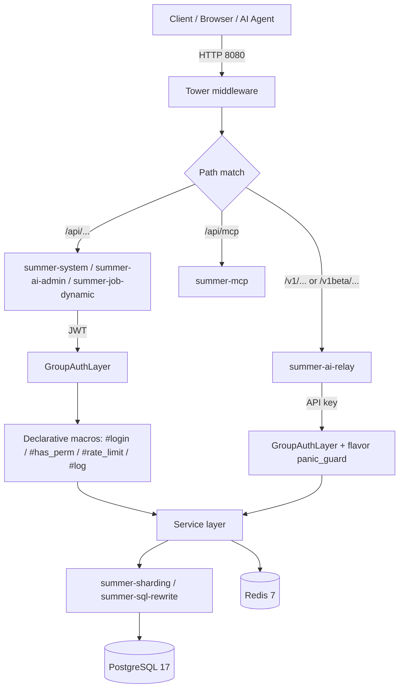
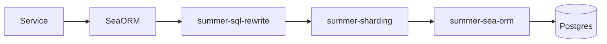

# Architecture Overview

> Detailed Chinese version: [`/guide/architecture/overview`](/guide/architecture/overview).

The core thesis: **plugin composition over scaffolding**. Every runtime capability is a `Plugin` registered in `crates/app/src/main.rs` in dependency order.

## Request flow



## Three entry domains

`crates/app/src/router.rs`:

```rust
pub fn router() -> Router {
    let api_router = summer_system::router_with_layers()
        .merge(summer_ai_admin::router_with_layers())
        .merge(summer_job_dynamic::router_with_layers());

    Router::new()
        .nest("/api", api_router)              // domain 1: JWT
        .merge(auto_grouped_routers().default) // domain 3: default
        .layer(CatchPanicLayer::custom(handle_panic))
        .merge(summer_ai_relay::router_with_layers()) // domain 2: API key
        .layer(ClientIpSource::ConnectInfo.into_extension())
}
```

| Domain | Path | Auth | Panic |
|---|---|---|---|
| **admin / system** | `/api/*` | JWT | global `CatchPanicLayer` → RFC 7807 |
| **ai relay** | `/v1/*`, `/v1beta/*` | API key | per-flavor `*_panic_guard` |
| **default** | ungrouped handlers | none | global `CatchPanicLayer` |

Key design: `panic_guard` sits **outside** `GroupAuthLayer`, so even auth-stage panics are caught with the matching error flavor.

## AI Relay sub-routing

`crates/summer-ai/relay/src/router/mod.rs` splits relay into three families, each with its own `ApiKeyStrategy::for_group(_, ErrorFlavor::*)` and panic guard, then merges them under a shared `RequestId` layer.

## Decoupling

Each crate owns its own `router_with_layers()` returning a fully decorated `Router`. The `app` crate only composes — it doesn't import internal types like `ApiKeyStrategy` or `ErrorFlavor`.

## Data layer



See [Multi-tenancy](../core/multi-tenancy).

## Next

- [17 plugins](./plugins) — what each does, dependencies, config
- [Directory layout](./directory) — crate split, where new code goes
