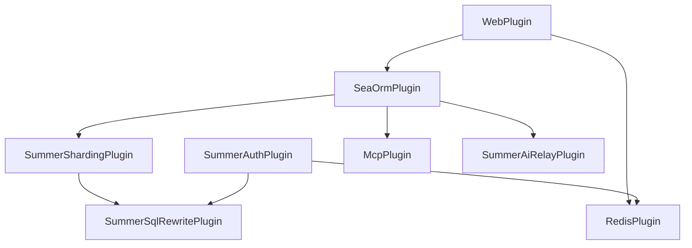

# Plugins

> Full Chinese reference: [`/guide/architecture/plugins`](/guide/architecture/plugins).

Registration order in `crates/app/src/main.rs`:

| # | Plugin | Crate | Config | Notes |
|---|---|---|---|---|
| 1 | `WebPlugin` | summer-web | `[web]`, `[web.openapi]`, `[web.middlewares]` | Axum HTTP server |
| 2 | `SeaOrmPlugin` | summer-sea-orm | `[sea-orm]`, `[sea-orm-web]` | Postgres pool |
| 3 | `RedisPlugin` | summer-redis | `[redis]` | Redis pool |
| 4 | `SummerShardingPlugin` | summer-sharding | `[summer-sharding]` | SQL rewriting / multi-tenancy |
| 5 | `SummerSqlRewritePlugin` | summer-sql-rewrite | — | Auth context injection into SQL |
| 6 | `JobPlugin` | summer-job | — | inventory-registered handlers |
| 7 | `SummerSchedulerPlugin` | summer-job-dynamic | — | DB-driven cron |
| 8 | `MailPlugin` | summer-mail | `[mail]` | SMTP |
| 9 | `SummerAuthPlugin` | summer-auth | `[auth]` | JWT, sessions |
| 10 | `PermBitmapPlugin` | summer-system | — | O(1) permission checks |
| 11 | `SocketGatewayPlugin` | summer-system | `[socket_io]`, `[socket-gateway]` | Socket.IO over Redis |
| 12 | `Ip2RegionPlugin` | summer-plugins | `[ip2region]` | IP geolocation |
| 13 | `S3Plugin` | summer-plugins | `[s3]` | S3 / MinIO / RustFS |
| 14 | `BackgroundTaskPlugin` | summer-plugins | — | 4 workers / 4096 capacity |
| 15 | `LogBatchCollectorPlugin` | summer-plugins | `[log-batch]` | Batch operation log writer |
| 16 | `McpPlugin` | summer-mcp | `[mcp]` | Embedded or standalone MCP server |
| 17 | `SummerAiRelayPlugin` | summer-ai-relay | — | OpenAI / Claude / Gemini relay |
| 18 | `SummerAiBillingPlugin` | summer-ai-billing | — | 3-stage billing |
| 19 | `SummerAiAgentPlugin` | summer-ai-agent | `[agent]` | rig-core agent (optional) |

## Disable a plugin

Comment it out in `main.rs`, or use the plugin's own `enabled = false` toggle (e.g. `[mcp].enabled = false`).

## Dependency graph

Order is enforced by `Plugin::dependencies()`; Summer initializes them in topological order.
