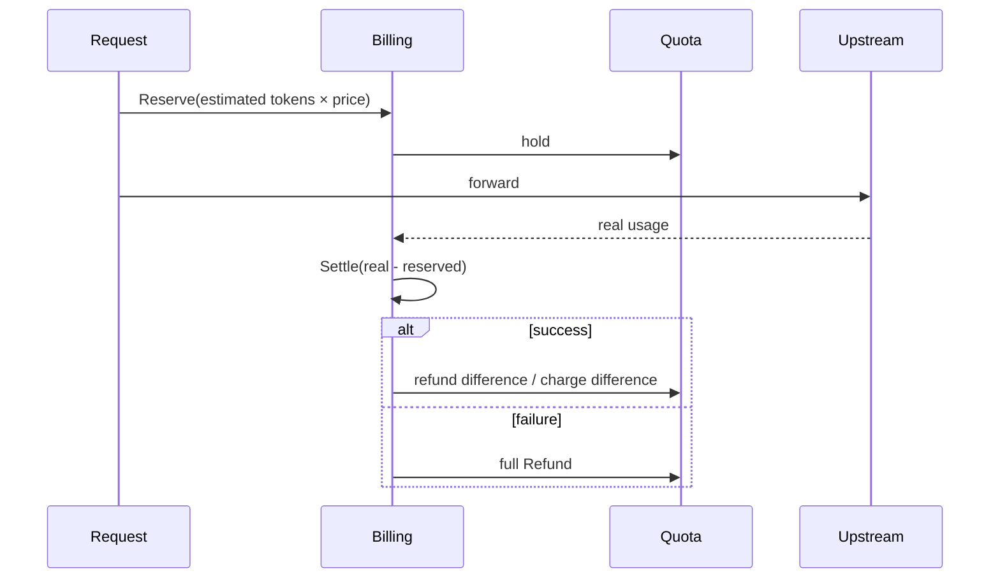

# AI Gateway

> Full Chinese version: [`/guide/core/ai-gateway`](/guide/core/ai-gateway).

| Sub-crate | Role |
|---|---|
| `summer-ai/core` | Protocol core types & traits |
| `summer-ai/model` | SeaORM entities + DTO/VO |
| `summer-ai/relay` | Relay engine + OpenAI / Claude / Gemini routers |
| `summer-ai/admin` | AI admin APIs |
| `summer-ai/billing` | 3-stage billing |
| `summer-ai/agent` | rig-core agent (optional) |

## Three protocol entrypoints

| Protocol | Path | Auth | Error flavor |
|---|---|---|---|
| **OpenAI** | `/v1/chat/completions`, `/v1/responses`, `/v1/models` | API key | `{"error": {...}}` |
| **Claude** | `/v1/messages` | API key | `{"type": "error", ...}` |
| **Gemini** | `/v1beta/models/{target}` | API key | Gemini-style JSON |

Each protocol has its own `ApiKeyStrategy::for_group(_, ErrorFlavor::*)` and `*_panic_guard` so failures stay in the matching shape.

## 6-dim routing

| Dimension | Table | Purpose |
|---|---|---|
| Protocol family | static enum | OpenAI / Claude / Gemini |
| Endpoint | `ai.routing_target` | chat_completions / messages / etc. |
| Credentials | `ai.channel_account` | upstream API keys / OAuth tokens |
| Model mapping | `ai.model_config` | client model → upstream model |
| Extra headers | `ai.routing_rule.headers` | org id, project id, etc. |
| Strategy | `ai.routing_rule.strategy` | round_robin / weighted / priority / fallback |

## 3-stage billing



Reserve avoids over-charging under concurrency; Settle reconciles to real usage; Refund covers upstream failures.

## Hot reload

Everything that drives routing lives in DB tables (`ai.channel`, `ai.channel_account`, `ai.routing_rule`, `ai.routing_target`, `ai.model_config`, `ai.channel_model_price`, `ai.token`, `ai.user_quota`). `relay/src/service/channel_store.rs` polls and refreshes on a fixed interval — no restart required.

## Request log

`ai.request_log` captures `request_id`, flavor, endpoint, client/upstream model, channel id, prompt/completion tokens, latency, status, attempts, and cost. Available via `/api/ai-admin/request-log`.

## Calling examples

```bash
# OpenAI
curl -X POST http://localhost:8080/v1/chat/completions \
  -H "Authorization: Bearer sk-xxx" \
  -H "Content-Type: application/json" \
  -d '{"model":"gpt-4o-mini","messages":[{"role":"user","content":"Hello"}]}'

# Claude
curl -X POST http://localhost:8080/v1/messages \
  -H "Authorization: Bearer sk-xxx" \
  -H "Content-Type: application/json" \
  -H "anthropic-version: 2023-06-01" \
  -d '{"model":"claude-3-5-sonnet-latest","max_tokens":1024,"messages":[{"role":"user","content":"Hello"}]}'

# Gemini
curl -X POST "http://localhost:8080/v1beta/models/gemini-1.5-pro:generateContent?key=sk-xxx" \
  -H "Content-Type: application/json" \
  -d '{"contents":[{"parts":[{"text":"Hello"}]}]}'
```

## Source files

- `crates/summer-ai/relay/src/router/{mod,openai,claude,gemini}.rs`
- `crates/summer-ai/relay/src/{auth,service,convert,extract,pipeline}/`
- `crates/summer-ai/admin/src/router/` (15+ files)
- `crates/summer-ai/billing/src/`
