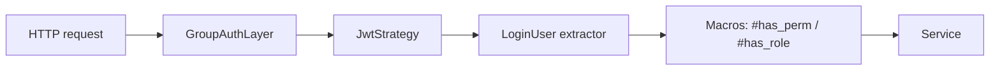

# Auth & Authorization

> Full Chinese version (with macro reference): [`/guide/core/auth`](/guide/core/auth).



## JWT config

```toml
[auth]
access_timeout = 7200       # access token lifetime (seconds)
refresh_timeout = 604800    # refresh token lifetime
concurrent_login = true
max_devices = 5
token_name = "Authorization"
token_prefix = "Bearer "
jwt_audience = "summer-admin"
jwt_issuer = "summer-admin"
jwt_algorithm = "HS256"
jwt_secret = "${JWT_SECRET:change-me-in-local-dev}"
```

Supported algorithms: **HS256 / RS256 / ES256 / EdDSA**. Production should prefer RS256 or EdDSA with key rotation.

## Declarative macros

```rust
use summer_admin_macros::{has_perm, has_perms, has_role, login, log, no_auth};

#[login]
#[get_api("/profile")]
async fn get_profile(LoginUser { session, .. }: LoginUser) -> ApiResult<Json<ProfileVo>> { ... }

#[has_perm("system:user:list")]
#[get_api("/user/list")]
async fn list_users(...) -> ApiResult<Json<...>> { ... }

#[has_perms(and("system:user:list", "system:user:add"))]
#[post_api("/user")]
async fn create_user(...) -> ApiResult<()> { ... }

#[has_perms(or("system:user:list", "system:role:list"))]
#[get_api("/overview")]
async fn overview(...) -> ApiResult<Json<...>> { ... }

#[has_role("admin")]
#[get_api("/admin/dashboard")]
async fn dashboard(...) -> ApiResult<Json<...>> { ... }

#[no_auth]
#[get_api("/health")]
async fn health() -> ApiResult<Json<&'static str>> { Ok(Json("ok")) }
```

Wildcards: `#[has_perm("system:*")]` matches any `system:foo:bar`.

## Bitmap RBAC

`PermBitmapPlugin` loads `sys.menu` (which carries both the `perm` string and a `bit_position` column) into memory at startup, building a two-way `PermissionMap`:

```text
auth_mark ↔ bit_position:
  "system:user:list"  ↔  0
  "system:user:add"   ↔  1
  ...
```

**On login**, the user's permission strings are encoded as a base64 bitmap and embedded in the JWT's `pb` claim — this is the key to keeping tokens short. 200+ permission codes shrink from a multi-KB string array to a few dozen base64 bytes.

**On verification**, `validate_token` decodes `pb` back into a string list and runs `permission_matches` for **wildcard-aware exact matching** (`crates/summer-auth/src/session/manager.rs`):

- Exact: `system:user:list` matches `system:user:list`
- Super: `*` matches everything
- Trailing wildcard: `system:*` matches `system:user:list`, `system:role:add`
- Middle wildcard: `system:*:list` matches `system:user:list`, `system:role:list`
- Segment count must match (unless ended in `*`)

> There is no "pure bit-AND" step — wildcard semantics can't be expressed by bitmaps alone. **The bitmap exists to compress the token, not to speed up matching** (string matching itself runs in hundreds of nanoseconds).

The source of truth for the bit positions is the `sys.menu.bit_position` column. Menus rarely change in production, so a startup-time full load works fine.

## Sessions

`crates/summer-auth/src/session/manager.rs` stores session state as **three independent string keys** in Redis, not a single aggregated hash:

```text
auth:device:{login_id}:{device}     → JSON { rid, login_time, login_ip, user_agent }
auth:refresh:{rid}                  → plain string "login_id:device" (reverse index)
auth:deny:{login_id}                → "banned" / "refresh:{ts}" (tri-state)
```

They are split because TTLs, lookup patterns, and lifecycles all differ. Detailed rationale: [the deep-dive blog post](/en/blog/auth-deep-dive).

| Endpoint | Purpose |
|---|---|
| `POST /api/auth/login` | Login |
| `POST /api/auth/logout` | Logout current device (writes deny=refresh:{ts}; other devices auto-refresh) |
| `POST /api/auth/refresh` | Trade refresh token for a new pair (one-shot) |
| `POST /api/auth/logout/all` | Logout all devices |
| `GET /api/auth/sessions` | List own active devices |
| `DELETE /api/auth/sessions/{device}` | Kick device |

`max_devices = 5` triggers the **earliest-logged-in device** (by `login_time`) to be evicted when a 6th login happens — not the least recently active.

## Force-out and refresh rotation

`summerrs-admin` has **no "token blocklist"**. A single key, `auth:deny:{login_id}`, carries three meanings:

| Trigger | Deny value | Effect |
|---|---|---|
| `ban_user(login_id)` | `"banned"` (TTL 365 days) | Every request *and* refresh rejected until `unban_user` clears it |
| `force_refresh(login_id)` after role change | `"refresh:{ts}"` (TTL = access_timeout) | **Only blocks tokens with iat ≤ ts**; new tokens pass automatically |
| `logout(login_id, device)` | delete device key + write `"refresh:{ts}"` | Target device exits; other devices' old tokens get RefreshRequired and auto-refresh **without disconnect** |

That's why the blog calls the deny key "a rotation trigger, not a blocker."

```rust
#[delete_api("/auth/sessions/{device}")]
pub async fn kick_session(
    LoginUser { session, .. }: LoginUser,
    Component(svc): Component<AuthService>,
    Path(device): Path<String>,
) -> ApiResult<()> {
    let device_type = DeviceType::from(device.as_str());
    svc.kick_device(&session.login_id, device_type).await?;
    Ok(())
}
```

`kick_device(Some(device))` calls `logout(login_id, device)` internally — kicking your own device and that device logging itself out have identical side effects: target device exits, all others go through one refresh cycle.

`concurrent_login = false` clears **every** existing device for the same user at login, so each user has exactly one active device at a time.

## Source files

- `crates/summer-auth/src/lib.rs`
- `crates/summer-auth/src/middleware.rs`
- `crates/summer-auth/src/path_auth.rs`
- `crates/summer-auth/src/bitmap.rs`
- `crates/summer-admin-macros/src/auth_macro.rs`
