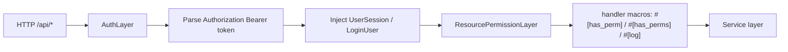

# Authentication & Resource Permissions

Summerrs Admin authentication is built by `summer-auth` and `summer-system` together. `summer-auth` handles JWTs, sessions, and token validation; `summer-system` provides login, refresh, logout, online devices, menu permissions, and backend API resource permissions. The main app registers these related plugins:

| Plugin | Purpose |
|---|---|
| `summer_auth::SummerAuthPlugin` | Reads `[auth]` config and registers `SessionManager` |
| `summer_system::plugins::PermBitmapPlugin` | Loads the permission bitmap mapping from `sys.menu` |
| `summer_system::plugins::ResourcePermissionPlugin` | Loads backend API resource policies from `sys.resource` and `sys.action_resource` |
| `summer_plugins::LogBatchCollectorPlugin` | Provides async batched writes for `#[log]` |

`crates/app/src/router.rs` mounts the `summer-system` route group under `/api`:

```rust
let api_router =
    summer_system::router_with_layers(grouped.take_group(summer_system::system_group()));

Router::new()
    .nest("/api", api_router)
    .merge(default_router)
```

`summer-system/src/router/mod.rs` then applies the authentication and resource-permission layers to the whole group:

```rust
pub fn router_with_layers(router: Router) -> Router {
    let group = crate::system_group();

    router
        .layer(ResourcePermissionLayer::new())
        .layer(AuthLayer::for_group(group))
}
```

A system request flows through the layers in this order:


```mermaid
flowchart LR
    A[HTTP /api/*] --> B[AuthLayer]
    B --> C[Parse Authorization Bearer token]
    C --> D[Inject UserSession / LoginUser]
    D --> E[ResourcePermissionLayer]
    E --> F["handler macros: #[has_perm] / #[has_perms] / #[log]"]
    F --> G[Service layer]
```

## JWT Config

Both development and production environments configure auth through `[auth]`:

```toml
[auth]
access_timeout = 7200
refresh_timeout = 604800
concurrent_login = true
max_devices = 5
per_request_deny_check = true
is_read_cookie = false
token_name = "Authorization"
token_prefix = "Bearer "
jwt_audience = "summer-admin"
jwt_issuer = "summer-admin"
jwt_algorithm = "HS256"
jwt_secret = "${JWT_SECRET:change-me-in-local-dev}"
```

Supported JWT algorithms are defined in `summer-auth/src/config.rs`: `HS256`, `HS384`, `HS512`, `RS256`, `RS384`, `RS512`, `ES256`, `ES384`, and `EdDSA`.

HMAC algorithms use `jwt_secret`; asymmetric algorithms use `jwt_private_key` and `jwt_public_key` pointing to PEM files. Tokens are read from headers by default. When `is_read_cookie = true` is enabled, cookie reading is attempted as well; cookie mode should be paired with CSRF protection.

## Login And Refresh

The system login handler is in `summer-system/src/router/auth.rs`:

```rust
#[no_auth]
#[log(module = "认证管理", action = "管理员登录", biz_type = Auth, save_params = false)]
#[post_api("/auth/login")]
pub async fn login(...) -> ApiResult<Json<LoginVo>> { ... }
```

The actual request path is:

```bash
curl -X POST http://localhost:8080/api/auth/login \
  -H "Content-Type: application/json" \
  -d '{"userName":"Admin","password":"123456"}'
```

`LoginDto` uses `#[serde(rename_all = "camelCase")]`, so the fields are `userName` and `password`. The response `data` is:

```json
{
  "accessToken": "eyJhbGciOi...",
  "refreshToken": "eyJhbGciOi...",
  "expiresIn": 7200
}
```

The login flow is:

1. Load the user by `sys.user.user_name`.
2. Check account status; disabled users are rejected.
3. Verify the password with Argon2.
4. Load role codes through `sys.user_role -> sys.role`.
5. Load enabled Button permissions through `sys.role_menu -> sys.menu`, using `auth_mark` as the permission code.
6. Call `SessionManager::login` to issue access and refresh tokens.
7. Write the login log asynchronously.

The refresh endpoint is public:

```rust
#[no_auth]
#[post_api("/auth/refresh")]
pub async fn refresh_token(...) -> ApiResult<Json<LoginVo>> { ... }
```

Refresh first parses the refresh JWT to get the user ID, reloads the latest roles and permissions from the database, then validates the Redis refresh key and rotates a new refresh token.

## Access And Refresh Responsibilities

The access JWT is self-contained. `AccessClaims` in `summer-auth/src/token/jwt.rs` includes:

| Field | Meaning |
|---|---|
| `sub` | Encoded login user ID |
| `typ` | `access` |
| `iat` / `exp` | Issued-at and expiry timestamps |
| `dev` | Device type |
| `user_name` / `nick_name` | User display fields |
| `roles` | Role code list |
| `permissions` | Permission code list, used when no bitmap is available |
| `pb` | Base64 permission bitmap, used when a `PermissionMap` is available |

The refresh JWT only stores `sub`, `typ`, `iat`, `exp`, and `rid`. The `rid` maps to Redis key `auth:refresh:{rid}`.

Redis session keys are mainly:

| Key | Content |
|---|---|
| `auth:device:{login_id}:{device}` | Device-session JSON, including refresh `rid`, login time, IP, and User-Agent |
| `auth:refresh:{rid}` | `login_id:device`, used for refresh-token rotation validation |
| `auth:deny:{login_id}` | `banned` or `refresh:{timestamp}` |

When `max_devices = 5`, the 6th login removes the earliest logged-in device. When `concurrent_login = false`, a new login clears all existing devices for that user.

## Public Routes

`#[public]` and `#[no_auth]` register public routes at compile time through `inventory`. When `AuthLayer::for_group(group)` starts, it merges public routes from the same group into `PathAuthConfig.exclude`.

System public endpoints include:

| Path | Source |
|---|---|
| `POST /api/auth/login` | `#[no_auth]` |
| `POST /api/auth/refresh` | `#[no_auth]` |
| `GET /api/public/file/{token}` | `#[public]` |

Other `summer-system` endpoints require login by default.

If a route macro cannot infer the public path automatically, specify it explicitly:

```rust
#[public(GET, "/health")]
#[get_api("/health")]
async fn health() -> ApiResult<()> {
    Ok(())
}
```

## Handler Permission Macros

Most management handlers use declarative permission macros:

```rust
#[has_perm("system:user:create")]
#[post_api("/user")]
pub async fn create_user(...) -> ApiResult<()> { ... }

#[has_perms(or("system:role:list", "system:user:create", "system:user:update"))]
#[get_api("/role/list")]
pub async fn list_roles(...) -> ApiResult<Json<Page<RoleVo>>> { ... }
```

Permission codes come from `auth_mark` on enabled `sys.menu` rows with `menu_type = Button`. `permission_matches` supports:

| Held permission | Matches |
|---|---|
| `system:user:list` | Exact same permission |
| `*` | Any permission |
| `system:*` | Everything under `system:` |
| `system:*:list` | Middle-segment wildcard |

`PermBitmapPlugin` loads `PermissionMap` from `sys.menu.bit_position` on startup. When a mapping exists, login compresses the permission list into the JWT `pb` field; when the mapping is missing, the JWT stores the `permissions` array. The bitmap mainly reduces token size. Wildcard matching still runs on decoded permission strings.

## Backend API Resource Permissions

In addition to handler-level `#[has_perm]`, the system provides a backend API resource-permission layer:

| Table | Purpose |
|---|---|
| `sys.resource` | Registers backend API resources, including method, path, and enabled status |
| `sys.action_resource` | Binds resources to Button menu `sys.menu.id` |
| `sys.menu` | The Button `auth_mark` is the final action permission |

`ResourcePermissionPlugin` loads enabled `sys.resource` rows on startup, queries their bound Button permissions, and builds an in-memory policy. `SysResourceService` calls `reload_policy()` after resource creation, update, enable/disable, deletion, or binding changes.

The resource layer intentionally uses pragmatic rules:

- If no login session has been injected yet, it skips and lets `AuthLayer` or public-route handling decide.
- If a registered resource has bound action permissions, the user may pass with any one bound permission.
- If a registered resource has not yet been bound to action permissions, it is temporarily allowed so resources can be entered gradually.
- Unregistered resources are allowed by default for compatibility with older endpoints.

In production, maintain both sides: handler `#[has_perm]` should not be omitted casually, and `sys.resource` bindings should be filled in over time.

## Devices And Force-Out APIs

Auth routes also provide device management:

| Method | Path | Description |
|---|---|---|
| `POST` | `/api/auth/logout` | Logout this device |
| `POST` | `/api/auth/logout/all` | Logout all devices |
| `GET` | `/api/auth/sessions` | List this user's online devices |
| `DELETE` | `/api/auth/sessions/{device}` | Kick one of this user's devices |

`online.rs` provides the admin view of online users:

| Method | Path | Permission |
|---|---|---|
| `GET` | `/api/online/list` | `system:online:list` |
| `DELETE` | `/api/online/{login_id}` | `system:online:kick` |
| `DELETE` | `/api/online/{login_id}/{device}` | `system:online:kick` |

Logout, device kick, and role/permission changes all use `auth:deny:{login_id}` to trigger old access tokens to refresh. `deny = "refresh:{ts}"` means old tokens with `iat <= ts` must refresh; `deny = "banned"` means the account is banned and both access and refresh are rejected.

## Operation Logs

System routes use `#[log]` heavily:

```rust
#[log(module = "用户管理", action = "创建用户", biz_type = Create)]
#[has_perm("system:user:create")]
#[post_api("/user")]
pub async fn create_user(...) -> ApiResult<()> { ... }
```

`#[log]` injects `OperationLogContext` and captures method, URL, query, User-Agent, client IP, the user from the login session, and duration. Logs are not written synchronously on the main request path. They are pushed to `OperationLogCollector`, then batched into `sys.operation_log` by `LogBatchCollectorPlugin`.

Sensitive endpoints should explicitly disable parameter or response logging. Login and password reset, for example, use `save_params = false`.
