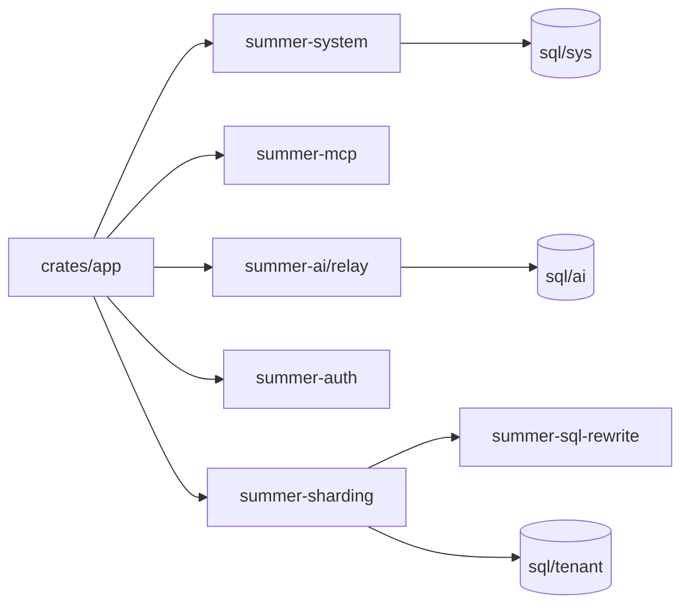

# Module Overview

This page does not dive into every implementation detail. It helps you build a workspace map before reading the code.

## How to understand the top-level directories

From the current repository structure, the most important parts to recognize first are:

```tree
summerrs-admin
├── config
│   ├── app-dev.toml
│   ├── app-prod.toml
│   └── app-test.toml
├── crates
│   ├── app
│   ├── summer-system
│   ├── summer-mcp
│   ├── summer-ai
│   ├── summer-sharding
│   └── summer-sql-rewrite
├── docs
├── locales
└── sql
    ├── ai
    ├── migration
    ├── sys
    └── tenant
```

- `crates/`
  Most business code lives here, split into multiple crates by responsibility
- `config/`
  Runtime configuration entry points, with `app-dev.toml` being the first file to inspect for local development
- `sql/`
  The source of truth for database schema and seed data
- `docs/`
  Internal design notes, migration records, and research documents
- `locales/`
  i18n text resources

## Core crates you will meet first

### `crates/app`

The main application entry. It assembles web, database, Redis, auth, MCP, AI Relay, sharding, SQL rewrite, object storage, and more, so it is the first stop when starting locally.



### `crates/summer-system`

The system-domain admin APIs and business logic. At the moment it covers:

- Authentication and sessions
- Users, roles, menus, dictionaries, and configuration
- Files and folders
- Login logs, operation logs, and notifications
- Online users, cache monitoring, and server monitoring
- Part of the tenant control plane

If your first checks are `/api/auth/login`, `/api/user/info`, and `/api/docs`, you are mostly interacting with this crate.

### `crates/summer-mcp`

The core MCP Server implementation. The current repository clearly exposes capabilities such as:

- Schema discovery
- Generic table-level CRUD tools
- Read-only SQL and explicit SQL tools
- SeaORM entity generation
- Backend CRUD module generation
- Frontend API and page bundle generation
- Menu and dictionary business tools

It can run embedded inside the main app or as the standalone `summerrs-mcp` binary.

### `crates/summer-ai`

This group of crates is responsible for AI-related capabilities, further split into:

- `core`
- `model`
- `relay`
- `admin`
- `billing`

The code already shows OpenAI-compatible endpoints, AI management APIs, routing, billing, and platform model abstractions, which makes it a strong base for an AI control plane.

### `crates/summer-sharding`

Responsible for multi-tenant isolation, data source routing, CDC, migration orchestration, sharding, and performance-related infrastructure. Together with `summer-sql-rewrite`, it supports more advanced tenant and data-isolation strategies.

### `crates/summer-sql-rewrite`

Handles SQL rewriting and context injection, mainly supporting tenant isolation and query-layer extensions.

### Other useful foundation crates

- `crates/summer-auth`
  Authentication, tokens, sessions, and permission bitmap capabilities
- `crates/summer-common`
  Common responses, errors, rate limiting, extractors, and other shared infrastructure
- `crates/summer-domain`
  Shared domain-layer models and capabilities
- `crates/summer-plugins`
  Shared plugins such as S3, IP2Region, background jobs, and log collection

## How `sql/` maps to runtime capabilities

The current `sql/` directory is divided by business domain, and roughly maps back to crates:

- `sql/sys/`
  System-domain base tables and seed data, best imported first
- `sql/tenant/`
  Tables for the tenant control plane
- `sql/ai/`
  Tables for AI relay, gateway, and control-plane related data
- `sql/migration/`
  Historical migrations and one-off repair scripts

If you are only verifying backend auth and OpenAPI right now, importing `sql/sys/` is enough. Add the others when you move into AI or tenant capabilities.

## Where to read code first

If local startup already works, this reading order is the most efficient:

1. `crates/app/src/main.rs`
   See which plugins the main app assembles
2. `crates/summer-system/src/router/`
   Check which system-domain APIs are exposed
3. `crates/summer-mcp/src/`
   Understand the relationship between embedded MCP and standalone MCP
4. `config/app-dev.toml`
   Tie ports, paths, and dependencies back to runtime config

## Suggested next step

If you know MCP will be your main focus, continue with the [API Overview](/api/). If you plan to extend a specific business module, start from the corresponding crate's `router`, `service`, and `model/sql` areas.
