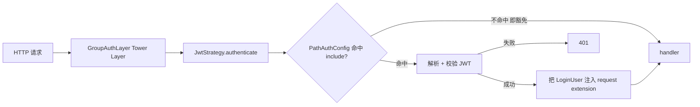
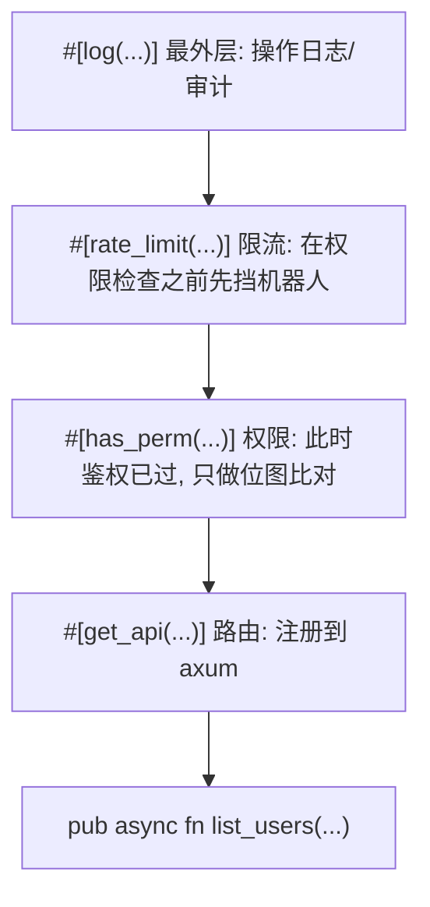

# 我为什么爱上了 Rust 的宏

> 从 `#[has_perm]` 到 `#[log]` —— 用宏写 admin 的体验,以及我对 Rust 宏系统的一些不太成熟的看法。

如果你和我一样从 Java/Spring 那套注解世界过来,会觉得 Rust 的过程宏是又像又不像。
像的部分:都是"贴一个 attribute 就拥有某种行为"。
不像的部分:Rust 宏在**编译期就把代码吐出来了**,不是运行时再反射查表。

这篇我想讲三件事:

1. `summerrs-admin` 里到底有哪些宏(全家福)
2. 宏跟 Java 注解、Python 装饰器、C# Attribute、C++ 宏 究竟差在哪
3. 我为什么从一开始嫌弃宏,到现在每个 handler 都恨不得堆四层

## 0. 先说结论

现在主仓 router 的**真实**形态长这样(`crates/summer-system/src/router/sys_notice.rs`,原样贴):

```rust
#[log(module = "系统公告", action = "创建", biz_type = Create)]
#[post_api("/notice")]
pub async fn create(
    LoginUser { profile, .. }: LoginUser,
    Component(svc): Component<SysNoticeService>,
    ValidatedJson(dto): ValidatedJson<CreateNoticeDto>,
) -> ApiResult<()> {
    svc.create(dto, &profile.nick_name).await?;
    Ok(())
}
```

两层属性宏 + handler。但宏 crate 一共能给你 4 层——把还没普及的 `#[has_perm]` 和 `#[rate_limit]` 都补上,**理想态**会长这样:

```rust
#[log(module = "系统公告", action = "创建", biz_type = Create)]
#[rate_limit(rate = 5, per = "second", key = "user")]
#[has_perm("system:notice:add")]
#[post_api("/notice")]
pub async fn create(
    LoginUser { profile, .. }: LoginUser,
    Component(svc): Component<SysNoticeService>,
    ValidatedJson(dto): ValidatedJson<CreateNoticeDto>,
) -> ApiResult<()> {
    svc.create(dto, &profile.nick_name).await?;
    Ok(())
}
```

四行属性宏,业务函数体两行。理想态拥有的能力是:

- **路由**:`#[post_api("/notice")]` 通过 `inventory` 注册到 `summer-system` group → `router_with_layers()` 把 group 内全部 handler 集中挂上 JWT layer → `crates/app/src/router.rs` `nest("/api", ...)` 拼装出最终 `POST /api/notice`
- **权限校验**:没有 `system:notice:add` 权限直接 403,通配符 `system:*` 也认
- **限流**:每个登录用户每秒最多 5 次,超出 429
- **操作日志**:请求参数、响应、耗时、操作人异步写到 `sys_operation_log`,panic 都能捕获

> **现状交代**:`#[log]` 在主仓已经全面铺开,十几个 router 都在用;`#[has_perm]` 和 `#[rate_limit]` 宏本身实现完整(都有单元测试),但**还没在主仓 router 上挂起来**——`job_router.rs` 文件头注释明明白白写着"开发期暂未挂 `#[has_perm]`,上线前需补回权限校验"。下文讨论"标准款"指的是宏完全铺开后的状态,不是当下生产代码。

注意我没说"登录校验" —— **登录校验根本不是宏的事**,是中间件的事。这个区别下一节会专门讲。

## 1. 没有宏的时候

最早那一版 handler,假设鉴权这一层中间件已经把 `LoginUser` 注入到 request extension 了(后面会讲),业务里要做的还有一长串:

```rust
pub async fn list_users(
    login_user: LoginUser,
    Query(query): Query<PageQuery>,
    Component(svc): Component<SysUserService>,
    Component(log_svc): Component<OperationLogService>,
    method: Method,
    uri: Uri,
    ClientIp(ip): ClientIp,
) -> ApiResult<Json<PageResult<UserVo>>> {
    // —— 1. 权限 ——
    if !login_user.has_perm("system:user:list") {
        return Err(ApiErrors::Forbidden);
    }

    // —— 2. 限流(自己撸的简陋 in-memory 版本) ——
    let rate_key = format!("user:{}", login_user.login_id);
    if !RATE_LIMITER.check(&rate_key, 10, Duration::from_secs(1)) {
        return Err(ApiErrors::TooManyRequests);
    }

    // —— 3. 操作日志:开始计时 ——
    let started = Instant::now();
    let req_params = serde_json::to_string(&query).ok();

    // —— 4. 业务 ——
    let result = svc.page(query).await;

    // —— 5. 操作日志:写入 ——
    let log_entry = OperationLog {
        login_id: login_user.login_id,
        module: "用户管理".into(),
        action: "列表查询".into(),
        biz_type: BizType::Query,
        method: method.to_string(),
        uri: uri.to_string(),
        ip: ip.to_string(),
        params: req_params,
        response: result.as_ref().ok().and_then(|r| serde_json::to_string(r).ok()),
        duration_ms: started.elapsed().as_millis() as i64,
        status: if result.is_ok() { LogStatus::Success } else { LogStatus::Failed },
        ..Default::default()
    };
    tokio::spawn(async move {
        if let Err(e) = log_svc.insert(log_entry).await {
            tracing::warn!("写操作日志失败: {e:?}");
        }
    });

    result.map(Json)
}
```

**50+ 行代码,业务逻辑只有 `svc.page(query).await` 那一行。**

更糟的是:每个 handler 都要写一遍。复制粘贴到第 5 个,我就开始想拆中间件。但 axum 中间件能拆走的只有"前置"和"后置"那种纯函数式逻辑,**像"日志要拿 handler 的返回值"这种横跨整个 handler 生命周期的需求,中间件碰不到** —— 想拿 response body,要么 buffer 整个 body 影响流式,要么解析 axum 内部类型。

写到第 8 个 handler,我决定上宏。

## 2. 鉴权 vs 权限:宏不管"谁能进",只管"进来的人能干啥"

讲宏之前,必须先把这条边界划清楚 —— **鉴权(谁能进)是中间件的事,权限(进来的人能干啥)才是宏的事**。

### 鉴权这条线:全在 `summer-auth` 中间件里

请求从进来到 handler 之间,要先过这一层:



三个关键件:

- **`GroupAuthLayer`**(`crates/summer-auth/src/group_layer.rs`) —— 一个 Tower Layer,把 `GroupAuthStrategy` 包成 axum 中间件
- **`JwtStrategy`**(`crates/summer-auth/src/jwt_strategy.rs`) —— 实现 `GroupAuthStrategy`,负责解析 `Authorization: Bearer ...`、校验签名/过期、组装 `LoginUser`
- **`PathAuthConfig`**(`crates/summer-auth/src/path_auth.rs`) —— 路径策略表:`include` 是要鉴权的 pattern,`exclude` 是豁免的 pattern

启动时 admin 域大概这么配:

```rust
let cfg = PathAuthConfig::new()
    .include("/api/admin/**")                                  // 默认全要鉴权
    .exclude_method(MethodTag::Post, "/api/admin/auth/login")  // 登录接口豁免
    .extend_excludes_from_public_routes("summer-system");      // 把 #[public] 标注的路由批量拉进来
```

注意第三行 —— `#[public]` / `#[no_auth]` 这俩宏的工作并不是"自己去关掉鉴权",而是**用 `inventory::submit!` 把路由信息提交到一个全局表**,启动期 `PathAuthConfig` 主动拉这张表合并到 `exclude`。
**真正决定"谁能进"的是 `PathAuthConfig`,宏只是声明手段**。

### 那 `#[login]` 还有用吗?

严格说现在是冗余的。
默认所有 admin 路由都已经被 `include("/api/admin/**")` 纳入鉴权,过得了中间件意味着 handler 里**直接把 `LoginUser` 当参数解构就能用**:

```rust
#[get_api("/profile")]
pub async fn get_profile(
    LoginUser { login_id, .. }: LoginUser,        // ← 直接拿,不用宏
    Component(svc): Component<UserService>,
) -> ApiResult<Json<UserProfile>> { ... }
```

那 `#[login]` 我们为什么还留着?**做 PathAuthConfig 的二次保险**。
`PathAuthConfig` 用**通配符** `include("/api/admin/**")` / `exclude("/xxx/**")` 匹配,粒度难免粗——有些接口可能被通配符**意外豁免**(中间件不做鉴权),但 handler 自己其实需要登录。这时贴 `#[login]`:它展开后等价于在参数列表里塞 `_: LoginUser`,而 `LoginUser::from_request_parts` 从 request extension 取 `UserSession`,**取不到直接返 401**——和不写宏直接在参数解构 `LoginUser` 是同一回事,但属性形式让"这接口要登录"在阅读层面更显眼。

简言之:**通配符不够细的时候,`#[login]` 是 handler 那一层兜底要求登录的开关**。

### 权限/限流/日志:中间件能做,宏更顺手

讲清楚一点——这三件事**中间件其实都能做**。axum 的 `from_fn_with_state` 支持带参数的中间件,你完全可以为每个 route 单独挂一个携带"所需权限码 / 限流配额 / 日志元数据"的 layer:

```rust
// 完全可行的中间件方案
Router::new()
    .route("/users", get(list_users).layer(RequirePerm::new("system:user:list")))
    .route("/users", post(create_user).layer(RequirePerm::new("system:user:add")))
```

那为什么我们还是用宏?**表达力 + 维护成本**:

| 维度 | 中间件 | 宏 |
|---|---|---|
| **声明位置** | 跨文件——路由组装处和 handler 之间需要心智映射 | 跟 handler **同一个地方**,声明 = 实现 |
| **改写函数体** | 只能拦截前后,不能往函数体内塞代码 | 可以重写整个函数体(`#[log]` 的 `catch_unwind` 包装就是典型) |
| **多策略叠加** | 多个 layer 的执行顺序要靠 `Router` 拼装顺序推 | 属性堆叠顺序一目了然 |
| **每路由 boilerplate** | 每个路由都要重复贴 layer 调用 | 一行属性搞定 |

也就是说,这三件事**不是"中间件做不到"**,而是用宏写出来更紧凑、更容易看出 handler 的"约束面"。本文剩下"为什么爱"那部分讲的也是这个角度——不是宏独占某种能力,而是它把代价降下来了。

## 3. 全家福:10 个属性宏

`crates/summer-admin-macros/` 里目前一共 10 个 `#[proc_macro_attribute]`,分四类:

| 类别 | 宏 | 数量 |
|---|---|---|
| 认证类 | `#[login]` `#[public]` `#[no_auth]` `#[has_perm]` `#[has_role]` `#[has_perms]` `#[has_roles]` | 7 |
| 操作日志 | `#[log]` | 1 |
| 限流 | `#[rate_limit]` | 1 |
| 任务调度 | `#[job_handler]` | 1 |

下面分类讲。

### 3.1 认证类(7 个)

#### `#[login]` —— PathAuthConfig 通配符的二次保险

如第 2 节所述,鉴权主流程在 `PathAuthConfig` + `JwtStrategy` 那一层。但 `PathAuthConfig` 是用通配符匹配的,**粒度可能不够细**——某些接口被通配符意外豁免、handler 自己又确实需要登录时,贴 `#[login]` 就在 handler 这一层做二次保险。展开后等价于参数列表里塞 `_: LoginUser`,提取器在 extension 里拿不到 `UserSession` 直接 401。

#### `#[public]` / `#[no_auth]` —— 免鉴权(完全等价的别名)

通过 `inventory::submit!` 把当前路由注册到全局 `public_routes` 表,启动时被 `PathAuthConfig.extend_excludes_from_public_routes(group)` 拉进 `exclude`。

```rust
// 自动模式:从下方路由宏推导 method + path
#[public]
#[get_api("/health")]
pub async fn health_check() -> ApiResult<()> { Ok(()) }

// 手动:method + path
#[public(GET, "/legacy/endpoint")]
#[get_api("/legacy/endpoint")]
pub async fn legacy() -> ApiResult<()> { Ok(()) }

// 跨 crate 复用 group
#[public(group = "summer-system")]
#[get_api("/status")]
pub async fn status() -> ApiResult<()> { Ok(()) }
```

注册不是运行时塞 vec,是用 `inventory::submit!` 在编译期登记,**进程启动时一次性收集**。零运行时注册开销。

#### `#[has_perm("perm")]` —— 单权限

```rust
#[has_perm("system:user:list")]
#[get_api("/system/user/list")]
pub async fn list_users(...) -> ApiResult<...> { ... }
```

展开做两件事:

1. 在参数前注入 `__auth_guard: LoginUser`(从中间件已经放好的 extension 里拿)
2. 函数体开头检查权限,不足直接 `return Err(Forbidden)`

支持 `*` 通配符:`system:*` 匹配 `system:user:list`、`system:role:list` 等。

> **澄清一遍**:`#[has_perm]` 自己不做鉴权,它只做**字符串通配符匹配**——展开后就是 `__auth_guard.permissions().iter().any(|p| permission_matches(p, "system:user:list"))`。鉴权早在中间件那一层就完成了——到这一步 `LoginUser` 已经在 extension 里。
>
> **位图(`bitmap.rs`)只是为了把权限列表压进 JWT/Redis** —— `encode` 把 `Vec<String>` 变成 base64 bitmap 节省存储,取出时 `decode` 回 `Vec<String>` 再做匹配。**位图不参与"加速比对"**——通配符(`system:*` 匹配 `system:user:list`)的存在让 bit AND 这种 O(1) 匹配根本做不到,比对还是走字符串路径。

#### `#[has_role("role")]` —— 单角色

跟 `has_perm` 同构,精确匹配,无通配符。

#### `#[has_perms(and(...))]` / `#[has_perms(or(...))]` —— 多权限

```rust
// 必须同时拥有
#[has_perms(and("system:user:list", "system:user:add"))]
#[post_api("/system/user")]
pub async fn create_user(...) -> ApiResult<()> { ... }

// 任一即可
#[has_perms(or("system:user:list", "system:role:list"))]
#[get_api("/overview")]
pub async fn overview(...) -> ApiResult<...> { ... }
```

#### `#[has_roles(and(...))]` / `#[has_roles(or(...))]` —— 多角色

跟上面同理,不再贴例子。

> **隐藏的小坑**:`#[login]` 和 `#[has_perm]` 都会在参数列表里注入 `LoginUser`,**两个一起贴会出现两个同类提取器**,axum 编译报错。日常用 `#[has_perm]` 就够,不要再叠 `#[login]`。

### 3.2 操作日志:`#[log]`

```rust
#[log(module = "菜单管理", action = "获取菜单树", biz_type = Query)]
#[get_api("/v3/system/menus")]
pub async fn get_menu_tree(
    LoginUser { login_id, .. }: LoginUser,
    Component(svc): Component<SysMenuService>,
) -> ApiResult<Json<Vec<MenuTreeVo>>> { ... }
```

**这是最长的一个宏**(`log_macro.rs` 746 行),因为它要做的事最多:

1. 注入一个 `OperationLogContext` 提取器(把 Method、Uri、HeaderMap、ClientIp、LoginId、Service 合在一起)
2. 用 `AssertUnwindSafe(async { ... }).catch_unwind().await` 包装函数体——同时捕获业务 `Err` **和 panic**
3. 根据执行结果推断状态(Success / Failed / Exception)和 HTTP 状态码
4. `tokio::spawn` 异步落库 `sys_operation_log`,**不阻塞响应**
5. 如果是 panic,`resume_unwind` 把原始 panic 重新抛出,不影响 axum 自己的 panic 处理链

参数:

| 参数 | 必填 | 默认 | 说明 |
|---|---|---|---|
| `module` | Y | — | 业务模块 |
| `action` | Y | — | 操作描述 |
| `biz_type` | Y | — | `Other / Create / Update / Delete / Query / Export / Import / Auth` |
| `save_params` | N | `true` | 敏感接口设 `false`(比如登录别留密码) |
| `save_response` | N | `true` | |

敏感接口写法:

```rust
#[log(module = "认证管理", action = "用户登录", biz_type = Auth, save_params = false)]
#[post_api("/auth/login")]
pub async fn login(...) -> ApiResult<Json<LoginVo>> { ... }
```

**额外一笔小确幸**:宏会顺手维护函数的 doc 注释——没 doc 时拿 `action` 当 summary,自动追加 `@tag {module}`,跟 OpenAPI 工具能直接对上。

### 3.3 限流:`#[rate_limit]`

```rust
// 单 IP 每秒 2 次
#[rate_limit(rate = 2, per = "second", key = "ip")]
#[get_api("/limited")]
async fn limited_handler() -> ApiResult<()> { Ok(()) }
```

参数比 `#[log]` 多不少,但默认值都合理:

| 参数 | 必填 | 默认 | 说明 |
|---|:---:|---|---|
| `rate` | Y | — | 每窗口请求数,必须 > 0 |
| `per` | Y | — | `"second" / "minute" / "hour" / "day"` |
| `key` | N | `"global"` | 维度:`global / ip / user / header:<name>` |
| `backend` | N | `"memory"` | `memory / redis` |
| `algorithm` | N | `"token_bucket"` | 6 种算法,见下表 |
| `failure_policy` | N | `"fail_open"` | Redis 挂时:`fail_open / fail_closed / fallback_memory` |
| `burst` | N | = `rate` | 突发容量,**仅 `token_bucket` / `gcra` 接受**,其他算法贴会编译报错 |
| `max_wait_ms` | N | — | 最大排队等待毫秒,**仅 `throttle_queue` 必填且需 > 0** |
| `mode` | N | `"enforce"` | `enforce / shadow`(灰度只记不拦) |
| `message` | N | `"请求过于频繁"` | 命中限流时的错误文案 |

算法 6 种:`token_bucket / gcra / fixed_window / sliding_window / leaky_bucket / throttle_queue`。其中 `throttle_queue` 也接受 `queue` / `throttle` 别名。
违反"哪个算法支持哪个参数"的约束会在 `parse_macro_input!` 阶段被拦下来——比如 `#[rate_limit(... algorithm = "fixed_window", burst = 10)]` 直接编译失败,这是宏类型安全的好处(详见 6.3)。

**`shadow` 模式**最近救过我一次:上线新限流规则前先跑一周 shadow,看 stats 里"如果 enforce 会拦多少",发现规则太紧立刻调,没影响线上。

### 3.4 任务调度:`#[job_handler]`

```rust
#[job_handler("summer_system::s3_multipart_cleanup")]
async fn s3_multipart_cleanup(ctx: JobContext) -> JobResult {
    let s3: aws_sdk_s3::Client = ctx.component();
    let config = ctx.config::<S3Config>()?;
    // ...
    Ok(serde_json::json!({"aborted": 0}))
}
```

宏做的事:

1. 保留原 `async fn`
2. 生成内部包装函数,把 `async fn` 转成 `fn(JobContext) -> Pin<Box<dyn Future + Send>>`
3. `inventory::submit!` 注册到 `summer_job_dynamic::JobHandlerEntry`(name → fn 映射表)

启动时 `HandlerRegistry::collect()` 把所有 entry 扫成一张表,调度器按数据库 `sys_job.handler` 字段查表执行。
**改 cron、启停、手工触发,全部走数据库,不用重编译**。这是 `summer-job-dynamic` 名字里"dynamic"的来源。

## 4. 一个完整的 handler 长什么样

把上面这些堆起来,顺序是有讲究的:



### 几条铁律

1. **`#[log]` 必须在路由宏上方**——它要看到下方未展开的 `*_api` 属性来校验"贴的位置对不对"
2. **`#[rate_limit]` 必须在路由宏外面**——同样要拿到路由宏作为锚点
3. **认证宏(`#[has_perm]` 之类)放在路由宏正上方**——展开后直接接管参数列表
4. **`#[public]` 和 `#[has_perm]` 互斥**——一个免鉴权一个要权限,逻辑矛盾
5. **多个认证宏不要叠**——`#[login]` + `#[has_perm]` 会注入两次 `LoginUser`,axum 编译报错

记住"**日志在最外、限流次之、权限在路由正上、路由最贴近函数**",就不会乱。

## 5. 跟其他语言的对应物比一比

写 Rust 宏之前,我用过 Java 注解、Python 装饰器、TS 装饰器。C++ 宏我没真写过,但作为最古老、最广为人知的"代码生成"机制,绕不过去,也一起放进对比。这一节把它们摆一起对比,你就明白 Rust 过程宏到底"特别"在哪。

### 5.1 Java/Spring 注解

```java
@RestController
public class UserController {
    @PreAuthorize("hasRole('ADMIN')")
    @GetMapping("/users")
    public List<User> list() { ... }
}
```

- **实现位置**:运行时反射 + 字节码增强(CGLIB / JDK Proxy)
- **运行时开销**:每次调用都要走代理对象、反射查表
- **类型安全**:`@PreAuthorize("hasRole('ADMIN')")` 里那段是 SpEL **字符串**,拼错了运行时才崩
- **IDE 支持**:IntelliJ 满级,跳转、补全、错误提示都到位

Spring 的注解威力大,生态也成熟,但**每次请求都要付反射开销**这件事是改不了的。

### 5.2 Python 装饰器

```python
@app.route("/users")
@require_login
def list_users():
    ...
```

- **实现位置**:**纯运行时**——装饰器就是高阶函数,把原函数包一层返回新函数
- **运行时开销**:每次调用都过包装函数(几个函数指针跳转)
- **类型安全**:几乎没有,类型注解只是给 mypy 看的提示
- **灵活性**:**最高**——拿到原函数对象后想干什么干什么,运行时还能动态替换

灵活但**行为不稳定**。两个装饰器顺序换一下,效果可能完全不同。Debug 起来很容易绕进去。

### 5.3 TypeScript 装饰器(NestJS)

```typescript
@Controller('users')
export class UserController {
  @UseGuards(AuthGuard)
  @Get()
  list() { ... }
}
```

- **实现位置**:**实验性元数据 + reflect-metadata**(运行时)
- **运行时开销**:NestJS 在启动期把元数据扫一遍建立路由表,运行时再查表
- **类型安全**:函数签名有类型,但元数据是 runtime 的
- **IDE 支持**:VS Code 跟 IntelliJ 都行

TS 装饰器跟 Python 是亲戚,但因为有静态类型在,体感比 Python 好一些。本质还是 runtime。

### 5.4 C# Attribute + Source Generator

C# 的故事比上面三家有意思,因为它**两套并存**:

```csharp
// 老牌 Attribute(运行时反射,跟 Java 同代际)
[HttpGet("users")]
[Authorize(Roles = "Admin")]
public IActionResult List() { ... }

// C# 9+ 引入的 Source Generator(编译期生成代码)
[GeneratedRegex("\\d+")]
private static partial Regex DigitRegex();
```

- **老 Attribute**:跟 Java 注解同款——运行时反射 + IL 织入
- **Source Generator**:**编译期跑,生成新的 C# 代码加入项目编译**——这才是 Rust 过程宏的正经对应物
- **类型安全**:Source Generator 生成的是真 C# 代码,编译期就报错
- **运行时开销**:Source Generator 路径**零开销**,跟手写代码一样

C# 团队明显意识到了反射的代价,Source Generator 是把"运行时反射的能力前移到编译期"。**思想跟 Rust 过程宏完全一致**。

### 5.5 C++ 宏

```cpp
#define LOG(level, msg) \
    do { if (g_log_level >= (level)) std::cerr << (msg) << '\n'; } while (0)

#define MIN(a, b) ((a) < (b) ? (a) : (b))   // 经典坑: MIN(i++, j++) 会自增两次
```

- **实现位置**:**预处理器**——文本替换,在编译器看到代码之前完成
- **类型安全**:**完全没有**——`#define` 不知道类型、不知道作用域
- **报错**:展开后的代码出错,报错位置全是宏调用处,debug 噩梦
- **C++20+ 的 attributes**(`[[nodiscard]]` `[[likely]]`)是更现代的扩展,但功能比 Rust attribute macro 弱很多
- **C++26 反射提案**正在路上,真出了之后会更接近 Rust 宏

C++ 宏是"祖师爷",但也是**最危险**的那一个——文本替换连基本的语法树都不知道。

### 5.6 一张表对比

| 语言机制 | 实现位置 | 运行时开销 | 类型安全 | IDE 支持 |
|---|---|:---:|:---:|:---:|
| Java 注解 | 运行时反射 | 有 | 弱(SpEL 字符串) | 强 |
| Python 装饰器 | 运行时高阶函数 | 有 | 无 | 中 |
| TS 装饰器(NestJS) | 运行时 metadata | 有 | 中 | 强 |
| C# Attribute | 运行时反射 | 有 | 中 | 强 |
| **C# Source Generator** | **编译期生成代码** | **无** | **强** | 中 |
| C++ `#define` | 预处理器文本替换 | 无 | 无 | 弱 |
| **Rust 过程宏** | **编译期 AST 改写** | **无** | **强** | 中(rust-analyzer 在追) |

一句话总结:**Rust 过程宏 ≈ C# Source Generator 的"严格类型版" + C++ `#define` 的"AST 安全版"**。
你拿到的是装饰器的表达力、零运行时开销、**外加编译期的类型检查**——这三样在其他语言里很少能同时拿到。

## 6. 我为什么爱上了宏

讲完工具和对比,讲讲感受。

### 6.1 编译期完成,运行时零开销

`#[has_perm("system:user:list")]` 在编译期就被替换成实打实的 Rust 代码——一段直接调用 `LoginUser::has_perm` 的判断。**展开后跟你手写的代码长得一模一样**,JIT 之类的"热点优化"根本不需要。

我不是说"省那几十纳秒重要",我是说:**抽象层不收税**这件事让我用得心安理得。可以放心叠四层宏,因为知道展开后就是普通代码。

对比 5.1 里的 Spring `@PreAuthorize` ——你叠几层注解就要付几层反射开销,叠多了能在 profiler 里看见。Rust 这边叠四层宏是免费的。

### 6.2 横切关注点跟 handler 物理上贴在一起

"横切关注点"(cross-cutting concerns)是 AOP 那一派的术语:**日志、权限、限流跟业务正交**——不属于任何具体业务,但每个 handler 都需要。

第 2 节已经讲过,这些事中间件**也能**做。但宏给我的体验是:**你不需要再去 `Router` 拼装处维护一份"路由 ↔ 中间件参数"的映射**——`#[has_perm("system:user:list")]` 跟 handler 在同一行的视野里,改名、改参数、删除都是同处编辑。

读 handler 时也一样:看一眼属性区,这个接口的"约束"一目了然——要不要权限、限不限流、怎么记日志,**不需要跨文件去 router 里查它挂了哪些 layer**。

宏比中间件多的一点能力是 **可以重写整个函数体**——`#[log]` 那个 `catch_unwind` 包装,中间件也能做(layer 包装 `Service::call` 同样能 catch),但宏可以做得**和函数体融合得更紧**:比如想在函数体的某个特定位置插代码,只有宏能办。这不是日常需求,但需要的时候只有这一条路。

### 6.3 类型安全,编译期报错

Python `@app.route("/users/<int:id>")` 里的 `<int:id>` 是字符串,拼错了运行时才崩。
Rust 宏展开生成的是真正的 Rust AST,**所有错误都在 `cargo build` 时就抛出来**。

`#[has_perms(and("a", "b"))]` 里的 `and` 是参数枚举,拼成 `andd` 直接编译失败,不可能跑到生产环境。
`#[rate_limit(algorithm = "token_bukcet")]` 拼错算法名也是,宏内部 `parse_macro_input!` 阶段就 reject。

### 6.4 声明式胜过过程式

最后一条更主观:**`#[has_perm("system:user:list")]` 比一坨 `if !user.has_perm(...) { return Err(...) }` 好读**。

读 handler 时,看一眼属性区,这个接口的"约束"一目了然:要不要权限、限不限流、怎么记日志。
不需要在函数体里翻找业务逻辑之间夹的样板代码。**业务逻辑就是业务逻辑,约束就是约束**,物理上分开。

这条听起来虚,等你 review 第 100 个 handler 的时候就知道有多重要。

## 7. 也有不爽的地方

不写槽点这文章就是软文了。说几个真踩过的坑。

### 7.1 IDE 体验比想象的差

rust-analyzer 对过程宏的支持是"能用,但隔了一层"。展开后代码跳转不准、补全偶尔失灵、改宏定义后要等 rust-analyzer 重新分析(项目大的时候要好几秒)。

碰到诡异问题,**调试只能 `cargo expand`**——这个工具能输出宏展开后的完整代码,但读起来像在读编译器中间产物,人不友好。

这一条 IntelliJ 系的 Java 远超 Rust。生态成熟度的代价。

### 7.2 编译时间会增加

proc-macro 不是免费的,它本身要编译成 dylib,展开过程也要跑。我项目里加了 `summer-admin-macros` 之后,full rebuild 多了大概 15-20%。增量编译还好,因为 proc-macro 的输出有缓存。

但代价值不值,我自己掂量是值的——**每次写代码省的时间远超偶尔多等几秒编译**。

### 7.3 报错信息常常"指不到点上"

宏内部出错时,Rust 编译器的报错位置一般是**整个 `#[macro_call(...)]`** 这一行,不会精确到宏内部哪句话。如果宏写得不细致,用户拿到的报错就是"some error in macro expansion",对着属性发呆。

`summer-admin-macros` 内部已经尽量用 `syn::Error::new_spanned()` 把错误位置 attribute 到具体参数上,但仍然有限——比如展开后代码的类型错误,定位会指向 attribute 而不是具体哪个字段不匹配。

### 7.4 顺序敏感

第 4 节那 5 条铁律是真的会踩坑。我自己第一次把 `#[log]` 写在 `#[get_api]` 下面就遇到展开错误,愣了 5 分钟才意识到顺序错了。

宏理论上可以在展开时检测"我下方应该有路由宏",并提示用户"请把我移到上面",但这种友好提示需要花心思去写。目前是"展开失败 + 一段不太友好的报错"。

## 8. 结语

宏不是银弹。

它适合"**模式高度重复 + 单点抽象成本不划算**"的场景——权限、日志、限流、路由这种横切关注点正好是教科书级的适用场景。
但如果你拿宏去做业务逻辑(比如"用宏生成 CRUD"),很容易写出难维护的"代码生成器的代码生成器"。

我对宏的态度从一开始的"看不懂别人为啥用"到现在的"恨不得四层堆满",中间隔着的是**写过没宏的版本**。**你只有受过那 50 行样板代码的折磨,才会真正觉得 4 行 attribute 是奢侈**。

跟其他语言对比下来,Rust 宏的位置是清楚的:你想要 Java 注解的可读性、Python 装饰器的灵活、C++ 宏的零开销、外加 C# Source Generator 的编译期类型检查——以前要在不同语言之间换,现在一种语言全给你。

如果你也在写 Rust admin,而且在 axum/actix 里反复贴权限 + 日志 + 限流,试试动手写两个宏。
不用追求工业级精致——就把你最烦的那十行重复代码塞进一个 `#[your_macro]` 里。
你会上瘾的。

---

> 想看完整的宏实现?`crates/summer-admin-macros/` 一共 1984 行(`auth_macro.rs` 558 + `log_macro.rs` 746 + `rate_limit_macro.rs` 367 + `job_handler_macro.rs` 55 + `lib.rs` 258),`syn::parse_macro_input!` + `quote!` 撑起整个生态。
> 想看鉴权链路?`crates/summer-auth/` 里 `group_layer.rs` + `jwt_strategy.rs` + `path_auth.rs` 三个文件就是核心。
