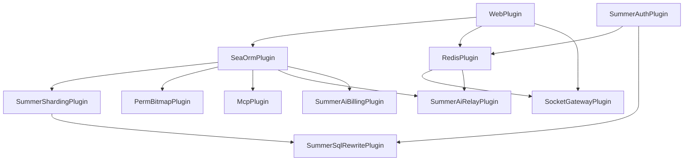

# 17 个插件清单

`crates/app/src/main.rs` 是组装入口,把所有运行时能力按依赖顺序串到 `App::new()`。下面是完整列表,顺序就是注册顺序。

## 注册顺序

```rust
App::new()
    .add_plugin(WebPlugin)                  // 1
    .add_plugin(SeaOrmPlugin)               // 2
    .add_plugin(RedisPlugin)                // 3
    .add_plugin(SummerShardingPlugin)       // 4
    .add_plugin(SummerSqlRewritePlugin)     // 5
    .add_plugin(JobPlugin)                  // 6
    .add_plugin(SummerSchedulerPlugin)      // 7
    .add_plugin(MailPlugin)                 // 8
    .add_plugin(SummerAuthPlugin)           // 9
    .add_plugin(PermBitmapPlugin)           // 10
    .add_plugin(SocketGatewayPlugin)        // 11
    .add_plugin(Ip2RegionPlugin)            // 12
    .add_plugin(S3Plugin)                   // 13
    .add_plugin(BackgroundTaskPlugin)       // 14
    .add_plugin(LogBatchCollectorPlugin)    // 15
    .add_plugin(McpPlugin)                  // 16
    .add_plugin(SummerAiRelayPlugin)        // 17
    .add_plugin(SummerAiBillingPlugin)      // 18
    .add_plugin(SummerAiAgentPlugin)        // 19(可选)
    .add_jobs(summer_job::handler::auto_jobs())
    .add_router(router::router())
    .run()
    .await;
```

> 实际是 19 行注册,其中 17 个是核心能力插件,另外 2 个是可选(`Scheduler` 与 `AiAgent`)。

## 详细列表

### 1. `WebPlugin`(summer-web)

| 项 | 值 |
|---|---|
| 来源 | `summer-web 0.5` |
| 配置段 | `[web]`, `[web.openapi]`, `[web.middlewares]` |
| 作用 | 启动 axum HTTP server,装 CORS / 压缩 / 限流 / 静态资源等基础中间件 |

**关键参数**:
- `[web].port = 8080`
- `[web].graceful = true`(优雅关机)
- `[web.openapi].doc_prefix = "/docs"`(Swagger UI)
- `[web.middlewares].cors`(默认开 `*`,生产建议收紧)

### 2. `SeaOrmPlugin`(summer-sea-orm)

| 项 | 值 |
|---|---|
| 配置段 | `[sea-orm]`, `[sea-orm-web]` |
| 提供组件 | `DatabaseConnection` |
| 作用 | PostgreSQL 连接池(基于 SeaORM 2.0 + tokio-postgres + rustls) |

`features = ["postgres", "rustls", "with-web", "with-web-openapi"]`,自动给 OpenAPI 生成分页/排序 schema。

### 3. `RedisPlugin`(summer-redis)

| 项 | 值 |
|---|---|
| 配置段 | `[redis]` |
| 提供组件 | `RedisClient` |
| 作用 | Redis 连接池,会话 / 缓存 / 限流 / Socket.IO 状态都用它 |

### 4. `SummerShardingPlugin`(summer-sharding)

| 项 | 值 |
|---|---|
| 依赖 | `SeaOrmPlugin` |
| 配置段 | `[summer-sharding]`, `[summer-sharding.tenant]` |
| 作用 | SQL 改写中间件,实现四级租户隔离、分片、加密、脱敏 |

详见 [多租户](../core/multi-tenancy)。

### 5. `SummerSqlRewritePlugin`(summer-sql-rewrite)

| 项 | 值 |
|---|---|
| 依赖 | `SummerShardingPlugin`, `SummerAuthPlugin` |
| 作用 | 在 SQL 层注入鉴权信息(当前用户、租户、权限),实现行级安全 |

`features = ["summer-auth"]` 让它能读取 `summer-auth` 注入的当前请求上下文。

### 6. `JobPlugin`(summer-job)

| 项 | 值 |
|---|---|
| 来源 | `summer-job 0.5` |
| 作用 | inventory 注册的 `#[job_handler("name")]` 任务,启动期收集成 `name → fn` 表 |

### 7. `SummerSchedulerPlugin`(summer-job-dynamic)

| 项 | 值 |
|---|---|
| 配置段 | 无独立段(用 sys_job 表) |
| 作用 | 动态调度器,从 `sys_job` 表读取 cron 配置,运行时启停不重编译 |

详见仓库 `doc/dynamic-job-scheduler-design.md`。

### 8. `MailPlugin`(summer-mail)

| 项 | 值 |
|---|---|
| 配置段 | `[mail]` |
| 作用 | SMTP 发邮件(注册激活 / 找回密码等),支持 stub 模式 |

### 9. `SummerAuthPlugin`(summer-auth)

| 项 | 值 |
|---|---|
| 依赖 | `RedisPlugin` |
| 配置段 | `[auth]` |
| 作用 | JWT 鉴权(HS256 / RS256 / ES256 / EdDSA)、会话管理、设备并发控制 |

详见 [认证授权](../core/auth)。

### 10. `PermBitmapPlugin`(summer-system::plugins)

| 项 | 值 |
|---|---|
| 依赖 | `SeaOrmPlugin` |
| 作用 | 把所有权限位编译成 bitmap,O(1) 检查;`#[has_perm]` 宏背后用的就是它 |

### 11. `SocketGatewayPlugin`(summer-system::plugins)

| 项 | 值 |
|---|---|
| 依赖 | `WebPlugin`, `RedisPlugin` |
| 配置段 | `[socket_io]`, `[socket-gateway]` |
| 作用 | Socket.IO 网关,会话状态走 Redis,可水平扩展 |

### 12. `Ip2RegionPlugin`(summer-plugins)

| 项 | 值 |
|---|---|
| 配置段 | `[ip2region]` |
| 数据文件 | `./data/ip2region_v4.xdb`(随仓库) |
| 作用 | IP → 省/市 / 运营商 离线查询,登录日志自动归属 |

### 13. `S3Plugin`(summer-plugins)

| 项 | 值 |
|---|---|
| 配置段 | `[s3]` |
| 作用 | S3 / MinIO / RustFS 兼容存储,支持分片上传(默认 5GB 单文件) |

支持 CDN / 自定义域、分片清理(`s3_multipart_cleanup` job)、可选 `force_path_style`。

### 14. `BackgroundTaskPlugin`(summer-plugins)

| 项 | 值 |
|---|---|
| 默认 worker | 4 |
| 默认容量 | 4096 |
| 作用 | 类型化的异步任务队列,主请求路径不阻塞 |

### 15. `LogBatchCollectorPlugin`(summer-plugins)

| 项 | 值 |
|---|---|
| 配置段 | `[log-batch]` |
| 作用 | `#[log]` 宏产出的操作日志先入 channel,后台批量写库,默认 100 条/批 |

### 16. `McpPlugin`(summer-mcp)

| 项 | 值 |
|---|---|
| 依赖 | `SeaOrmPlugin` |
| 配置段 | `[mcp]` |
| 提供 | Embedded(挂在 `/api/mcp`)或 Standalone(独立 9090 端口) |

详见 [MCP](../core/mcp)。

### 17. `SummerAiRelayPlugin`(summer-ai/relay)

| 项 | 值 |
|---|---|
| 依赖 | `SeaOrmPlugin`, `RedisPlugin` |
| 提供 | OpenAI / Claude / Gemini 三套兼容入口 |

### 18. `SummerAiBillingPlugin`(summer-ai/billing)

| 项 | 值 |
|---|---|
| 作用 | 三阶段计费(Reserve / Settle / Refund),原子扣减用户配额 |

### 19. `SummerAiAgentPlugin`(summer-ai/agent,可选)

| 项 | 值 |
|---|---|
| 配置段 | `[agent]` |
| 作用 | rig-core 驱动的 Agent 能力,把内部 API 暴露给 LLM 工具调用 |

## 依赖图



> 依赖在 `Plugin::dependencies()` 里声明,Summer 框架会按依赖拓扑顺序初始化。

## 怎么禁用某个插件?

最简单的做法是在 `crates/app/src/main.rs` 里**注释掉对应行**。例如不要 AI 网关:

```rust
// .add_plugin(SummerAiRelayPlugin)
// .add_plugin(SummerAiBillingPlugin)
```

部分插件支持配置开关,例如 MCP:

```toml
[mcp]
enabled = false   # 整体禁用
```

`summer-sharding` 也有 `enabled` 开关。

## 参考源码位置

- 注册入口:`crates/app/src/main.rs`
- 路由组装:`crates/app/src/router.rs`
- 插件实现:`crates/summer-*/src/plugin.rs`
- 配置定义:每个 plugin crate 的 `config.rs`
