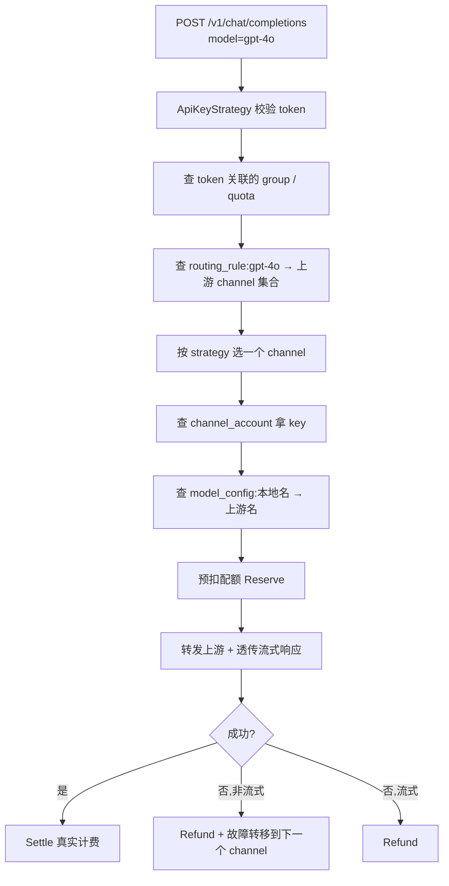
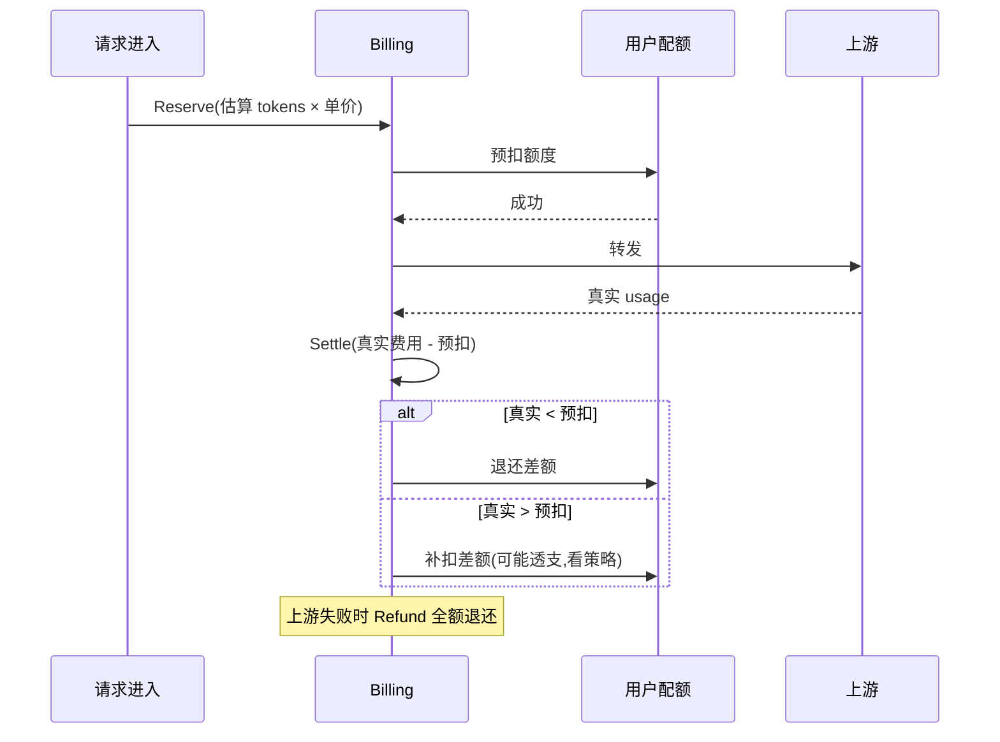
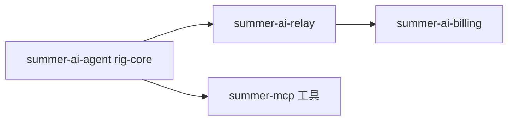

# AI 网关

`summer-ai` 是一个内嵌在主应用里的 LLM 中转网关。它和外部独立项目(one-api / new-api / AxonHub 等)的差异是:**和后台共用同一套鉴权、计费、审计、数据库**,运维只需要管一个进程。

## crate 划分

| 子 crate | 作用 |
|---|---|
| `summer-ai/core` | 协议核心类型与 trait |
| `summer-ai/model` | SeaORM 实体 + DTO / VO(数据契约) |
| `summer-ai/relay` | 中转引擎 + OpenAI/Claude/Gemini 协议入口 |
| `summer-ai/admin` | AI 管理后台 API(channel / vendor / token / quota...) |
| `summer-ai/billing` | 三阶段计费 + 配额扣减 |
| `summer-ai/agent` | rig-core 驱动的 Agent(可选) |

## 三大入口协议

`crates/summer-ai/relay/src/router/mod.rs` 把 relay 拆成三个独立子路由,每家协议独立鉴权 + 独立 panic guard:

| 协议 | 路径 | 鉴权 | 错误风格 |
|---|---|---|---|
| **OpenAI** | `/v1/chat/completions` `/v1/responses` `/v1/models` | API key (`Bearer sk-xxx`) | OpenAI 风格 `{"error": {...}}` |
| **Claude** | `/v1/messages` | API key | Claude 风格 `{"type": "error", ...}` |
| **Gemini** | `/v1beta/models/{target}` | API key | Gemini 风格错误 JSON |

```rust
// crates/summer-ai/relay/src/router/mod.rs
let openai = grouped_router(relay_openai_group())
    .layer(GroupAuthLayer::new(ApiKeyStrategy::for_group(
        relay_openai_group(), ErrorFlavor::OpenAI)))
    .layer(middleware::from_fn(openai_panic_guard));
// claude / gemini 同理
```

> 关键设计:每家 flavor 由路由结构静态决定,鉴权阶段的 panic 也会被对应 flavor 抓住。

## 6 维动态路由

`summer-ai/relay/src/service/` 把"模型请求 → 上游渠道"的映射做成 6 个维度,可在数据库里热改:

| 维度 | 表 | 用途 |
|---|---|---|
| **协议家族** | 静态枚举(OpenAI / Claude / Gemini) | 决定入口协议 |
| **Endpoint** | `ai.routing_target` | `chat_completions` / `messages` / `responses` 等具体能力点 |
| **凭证** | `ai.channel_account` | 上游 API key / OAuth token,支持轮询和故障转移 |
| **模型映射** | `ai.model_config` | 客户端模型名 → 上游真实模型名(例如 `gpt-4o` → `chatgpt-4o-latest`) |
| **额外 headers** | `ai.routing_rule.headers` | 给上游加自定义 header(组织 id、项目 id 等) |
| **路由策略** | `ai.routing_rule.strategy` | round_robin / weighted / priority / fallback |

请求路由过程:



## 40+ 上游适配器

`relay/src/service/chat/` 用 ZST(零大小类型)+ 静态分发的方式实现,**零运行时开销**。常见适配:

| 类别 | 上游 |
|---|---|
| OpenAI 兼容 | 官方 OpenAI / Azure OpenAI / DeepSeek / 阶跃 / 智谱 / Moonshot / 零一万物 / SiliconFlow ... |
| Anthropic 系 | 官方 Claude API |
| Google 系 | Gemini API / Vertex AI |
| OAuth | OpenAI ChatGPT OAuth / Claude OAuth(需要 `summer_ai_relay::service::oauth/`) |
| 国产专门 | 通义 / 文心 / 豆包 / 混元 ... |

新增适配只需要实现一个小 trait,放到 `service/chat/` 下,inventory 自动注册。

## 三阶段计费

`summer-ai/billing` 的计费链路是原子三段:



为什么要三阶段?

- 单阶段"算完再扣"在并发下会**超扣**(很多请求同时通过额度检查)
- 单阶段"先扣再用"会**多扣**(估算往往大于实际)
- 三阶段在 Reserve 时就锁定额度,Settle 时按真实 usage 找平,Refund 兜底失败场景

## 热更新

所有路由配置都在数据库里,改完**不需要重启**:

| 表 | 改了影响 |
|---|---|
| `ai.channel` | 通道开关 / 优先级 |
| `ai.channel_account` | 上游 API key 轮换 |
| `ai.routing_rule` | 模型 → 通道映射 |
| `ai.routing_target` | endpoint 与上游能力点关联 |
| `ai.model_config` | 模型名映射 |
| `ai.channel_model_price` | 价格 |
| `ai.token` | 用户 token / 限额 |
| `ai.user_quota` | 用户配额 |

`relay/src/service/channel_store.rs` 里有定时刷新机制(默认几十秒)。改完配置最多等一个刷新周期生效。

## 完整请求追踪

每条请求在 `ai.request_log` 表里有完整记录:

| 字段 | 含义 |
|---|---|
| `request_id` | 整链路追踪 id(也走 `X-Request-Id` header) |
| `flavor` | 入口协议(openai/claude/gemini) |
| `endpoint` | chat_completions / messages / ... |
| `client_model` | 客户端发的模型名 |
| `upstream_model` | 实际打给上游的模型名 |
| `channel_id` | 命中的 channel |
| `prompt_tokens` / `completion_tokens` / `total_tokens` | 真实 usage |
| `latency_ms` | 延迟 |
| `status` | success / error / timeout |
| `error_kind` / `error_detail` | 失败原因 |
| `attempts` | 失败重试次数 |
| `cost` | 真实费用(decimal) |

OpenAPI 后台也提供 `/api/ai-admin/request-log` 接口检索。

## OpenAI ChatGPT OAuth

`relay/src/service/oauth/` 支持把官网 ChatGPT 账号通过 OAuth 接进来当上游:

1. 用户在 AI 后台触发 OAuth 流程
2. 拿到 OpenAI 的 access_token + refresh_token,落到 `ai.channel_account`
3. 后台 job 自动续 refresh_token

这样就能用个人订阅当 API 用,流量计入个人订阅额度。

## 调用示例

```bash
# 创建一个 token(在 AI 后台 /api/ai-admin/token)
TOKEN=sk-xxxxxx

# OpenAI 风格
curl -X POST http://localhost:8080/v1/chat/completions \
  -H "Authorization: Bearer $TOKEN" \
  -H "Content-Type: application/json" \
  -d '{
    "model": "gpt-4o-mini",
    "messages": [{"role":"user","content":"Hello"}],
    "stream": false
  }'

# Claude 风格(同一个 token 即可)
curl -X POST http://localhost:8080/v1/messages \
  -H "Authorization: Bearer $TOKEN" \
  -H "Content-Type: application/json" \
  -H "anthropic-version: 2023-06-01" \
  -d '{
    "model": "claude-3-5-sonnet-latest",
    "max_tokens": 1024,
    "messages": [{"role":"user","content":"Hello"}]
  }'

# Gemini 风格
curl -X POST "http://localhost:8080/v1beta/models/gemini-1.5-pro:generateContent?key=$TOKEN" \
  -H "Content-Type: application/json" \
  -d '{
    "contents": [{"parts": [{"text": "Hello"}]}]
  }'
```

## 与 MCP / Agent 的关系



- `summer-ai-relay` 是中转层(代理上游)
- `summer-ai-agent` 是 Agent 层(用 rig-core 调中转 + MCP 工具)
- `summer-mcp` 是工具层(给 AI 助手暴露数据库 / 业务能力)

详见 [MCP](./mcp)。

## 参考源码

- 路由组装:`crates/summer-ai/relay/src/router/mod.rs`
- 协议子路由:`crates/summer-ai/relay/src/router/{openai,claude,gemini}/`
- 鉴权:`crates/summer-ai/relay/src/auth/`
- 上游 channel:`crates/summer-ai/relay/src/service/channel_store.rs`
- 流式驱动:`crates/summer-ai/relay/src/service/stream_driver.rs`
- 模型映射:`crates/summer-ai/relay/src/service/model_service.rs`
- 计费:`crates/summer-ai/billing/src/`
- 后台 API:`crates/summer-ai/admin/src/router/`(15+ 个文件)
- 设计文档:仓库根 `docs/relay/summer-ai/docs/{DESIGN,ROADMAP,MIGRATION}.md`
