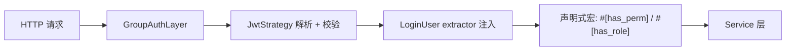

# 认证与授权

Summerrs Admin 的鉴权是分层设计的:



涉及 crate:

- `crates/summer-auth` —— JWT、会话、设备并发、路径策略
- `crates/summer-system::plugins::PermBitmapPlugin` —— 权限位图
- `crates/summer-admin-macros` —— `#[login]` `#[has_perm]` `#[has_role]` 等编译期宏

## JWT 配置

`config/app.toml`:

```toml
[auth]
access_timeout = 7200       # access token 秒数,默认 2 小时
refresh_timeout = 604800    # refresh token 秒数,默认 7 天
concurrent_login = true     # 是否允许多设备并发登录
max_devices = 5             # 单用户最大并发设备数
is_read_cookie = false      # 是否同时从 cookie 读 token
token_name = "Authorization"
token_prefix = "Bearer "
jwt_audience = "summer-admin"
jwt_issuer = "summer-admin"

# 默认 HS256
jwt_algorithm = "HS256"
jwt_secret = "${JWT_SECRET:change-me-in-local-dev}"

# 想用非对称算法把 HS256 段注释掉,改成
# jwt_algorithm = "RS256"
# jwt_private_key = "./data/rsa_private.pem"
# jwt_public_key = "./data/rsa_public.pem"
```

支持算法:**HS256 / RS256 / ES256 / EdDSA**(由 `jsonwebtoken` 0.10 提供)。生产建议用 RS256 或 EdDSA + 密钥轮转。

## 登录流程

`crates/summer-system/src/router/auth.rs`:

```rust
#[no_auth]
#[log(module = "认证管理", action = "管理员登录", biz_type = Auth, save_params = false)]
#[post_api("/auth/login")]
pub async fn login(
    Component(svc): Component<AuthService>,
    ClientIp(client_ip): ClientIp,
    headers: HeaderMap,
    ValidatedJson(dto): ValidatedJson<LoginDto>,
) -> ApiResult<Json<LoginVo>> {
    let ua_info = UserAgentInfo::from_headers(&headers);
    let vo = svc.login(dto, client_ip, ua_info).await?;
    Ok(Json(vo))
}
```

请求:

```bash
curl -X POST http://localhost:8080/api/auth/login \
  -H "Content-Type: application/json" \
  -d '{"username":"Admin","password":"123456"}'
```

返回 `LoginVo`:

```json
{
  "code": 200,
  "data": {
    "access_token": "eyJhbGciOi...",
    "refresh_token": "eyJhbGciOi...",
    "token_type": "Bearer",
    "expires_in": 7200,
    "user_info": { ... }
  }
}
```

## 受保护接口怎么写

声明式宏全部在 `crates/summer-admin-macros/src/lib.rs`,典型组合:

```rust
use summer_admin_macros::{has_perm, log, login};
use summer_auth::LoginUser;
use summer_common::{error::ApiResult, response::Json};
use summer_web::{get_api, post_api};

// 必须登录,无权限要求
#[login]
#[get_api("/profile")]
async fn get_profile(LoginUser { session, .. }: LoginUser) -> ApiResult<Json<ProfileVo>> {
    Ok(Json(load_profile(&session.login_id).await?))
}

// 单权限校验
#[has_perm("system:user:list")]
#[get_api("/user/list")]
async fn list_users(...) -> ApiResult<Json<...>> { ... }

// 多权限 AND
#[has_perms(and("system:user:list", "system:user:add"))]
#[post_api("/user")]
async fn create_user(...) -> ApiResult<()> { ... }

// 多权限 OR
#[has_perms(or("system:user:list", "system:role:list"))]
#[get_api("/overview")]
async fn overview(...) -> ApiResult<Json<...>> { ... }

// 单角色
#[has_role("admin")]
#[get_api("/admin/dashboard")]
async fn dashboard(...) -> ApiResult<Json<...>> { ... }

// 多角色 OR
#[has_roles(or("admin", "moderator"))]
#[delete_api("/post/{id}")]
async fn delete_post(...) -> ApiResult<()> { ... }

// 公共接口(免鉴权,会写到 PathAuthConfig.exclude)
#[no_auth]
#[get_api("/health")]
async fn health() -> ApiResult<Json<&'static str>> { Ok(Json("ok")) }
```

## 通配符权限

`#[has_perm]` 支持 `*` 通配符:

```rust
#[has_perm("system:*")]   // 匹配 system:user:list / system:role:add ...
#[has_perm("ai:relay:*")] // 匹配 AI 网关下所有权限
```

`admin` 角色默认有 `*`,可以匹配任意权限。

## 位图 RBAC

`PermBitmapPlugin` 在启动时把数据库里的 `sys.menu`(包含 `perm` 字段和 `bit_position` 列)加载进内存,构造一张双向映射 `PermissionMap`:

```text
auth_mark ↔ bit_position:
  "system:user:list"  ↔  0
  "system:user:add"   ↔  1
  ...
```

**登录时**,用户的权限码被编码成 base64 bitmap,塞进 JWT 载荷的 `pb` 字段 —— 这是压缩 token 体积的关键。200+ 权限码从几 KB 字符串数组压到几十字节的 base64。

**验证时**,`validate_token` 从 `pb` decode 回字符串数组,再过 `permission_matches` 做**支持通配符的精确匹配**(`crates/summer-auth/src/session/manager.rs`):

- 精确:`system:user:list` 匹配 `system:user:list`
- 超级:`*` 匹配任何权限
- 末尾通配:`system:*` 匹配 `system:user:list`、`system:role:add`
- 中间通配:`system:*:list` 匹配 `system:user:list`、`system:role:list`
- 段数不匹配时不通配

> 没有"纯位运算做匹配"这一步 —— 通配符语义靠纯位图是表达不了的。**bitmap 的价值在于 token 压缩,不在于检查速度**(字符串匹配本身也就几百纳秒)。

数据库里的 `sys.menu.bit_position` 字段就是这张表的 source of truth。菜单在生产环境很少改,启动期全量加载即可。

## 会话与设备管理

`crates/summer-auth/src/session/manager.rs` 把会话状态拆成**三种独立 string key** 存到 Redis,而不是一个聚合的 hash:

```text
auth:device:{login_id}:{device}     → JSON { rid, login_time, login_ip, user_agent }
auth:refresh:{rid}                  → 简单字符串 "login_id:device"(反向索引)
auth:deny:{login_id}                → "banned" / "refresh:{ts}"(三态共用)
```

之所以拆三份,是因为它们 TTL 不一样、查询模式不一样、生命周期也不一样 —— 详见 [博客深挖文章](/blog/auth-deep-dive)。

接口:

| 路径 | 作用 |
|---|---|
| `POST /api/auth/login` | 登录 |
| `POST /api/auth/logout` | 登出当前设备(写 deny=refresh:{ts},触发其他设备无感刷新) |
| `POST /api/auth/refresh` | 用 refresh token 换新的 access token(用过即焚) |
| `POST /api/auth/logout/all` | 登出所有设备 |
| `GET /api/auth/sessions` | 查看自己的全部在线设备 |
| `DELETE /api/auth/sessions/{device}` | 把指定设备踢下线 |

`max_devices = 5` 起作用:第 6 个设备登录会自动踢掉**最早登录的设备**(按 `login_time` 排序),不是最近一次活跃。

## 路径策略 PathAuthConfig

`#[no_auth]` 会在编译期把"method + path"塞进 `PathAuthConfig.exclude` 列表,中间件遇到这些路径直接跳过 JWT 校验。常见免鉴权路径:

- `POST /api/auth/login`
- `POST /api/auth/refresh`
- `GET /docs`(OpenAPI)
- `GET /api/captcha/*`(验证码)
- `GET /api/public-file/*`(公开下载)

如果路由宏推不出 path,可以手动指定:

```rust
#[public(GET, "/health")]
async fn health() -> ApiResult<()> { Ok(()) }

// no_auth 是 public 的别名
#[no_auth]
#[get_api("/version")]
async fn version() -> ApiResult<&'static str> { Ok("v0.0.1") }
```

## 强制下线与刷新流转

`summerrs-admin` **没有"token 黑名单"机制**,而是用 `auth:deny:{login_id}` 一个 key 承载三种语义:

| 触发点 | deny 值 | 效果 |
|---|---|---|
| `ban_user(login_id)` | `"banned"` (TTL 365 天) | 该用户所有请求 + refresh 全部拒绝,直到 `unban_user` 显式解除 |
| `force_refresh(login_id)` 角色变更时调 | `"refresh:{ts}"` (TTL = access_timeout) | **只拦 iat ≤ ts 的旧 token**,新 token 自动放行 |
| `logout(login_id, device)` | 删 device key + 写 `"refresh:{ts}"` | 目标设备退出;其他设备的旧 token 触发 RefreshRequired,**前端自动刷新不掉线** |

这就是为什么博客里说"deny 不是拦截器,是流转触发器"。具体代码:

```rust
#[delete_api("/auth/sessions/{device}")]
pub async fn kick_session(
    LoginUser { session, .. }: LoginUser,
    Component(svc): Component<AuthService>,
    Path(device): Path<String>,
) -> ApiResult<()> {
    let device_type = DeviceType::from(device.as_str());
    svc.kick_device(&session.login_id, device_type).await?;
    Ok(())
}
```

`kick_device(Some(device))` 内部调 `logout(login_id, device)` —— 所以**踢自己的某个设备**和**该设备自己 logout**,副作用一样:目标设备退出,其他设备走一次刷新换新 token。

`concurrent_login = false` 会在登录时清除**所有**同用户的已有设备,单用户同一时刻只能在一个设备活跃。

## 操作日志 `#[log]`

```rust
#[log(
    module = "用户管理",
    action = "创建用户",
    biz_type = Create,
    save_params = true,      // 是否记录请求参数,敏感接口设 false
    save_response = true     // 是否记录响应
)]
#[post_api("/user")]
async fn create_user(...) -> ApiResult<()> { ... }
```

`#[log]` 把记录扔进 `LogBatchCollectorPlugin` 的 channel,后台 worker 批量写 `sys.operation_log`,不阻塞主请求。详见 [限流与日志](./rate-limit) 末尾的"日志批量"段。

## 错误返回

| 场景 | HTTP 状态 | 错误体 |
|---|---|---|
| 没带 token | 401 | `{ code: 401, message: "..." }` |
| token 过期 | 401 | 同上 |
| 权限不足 | 403 | `{ code: 403, message: "..." }` |
| 限流 | 429 | `{ code: 429, message: "请求过于频繁" }` |
| panic | 500 | RFC 7807 ProblemDetails |

## 进一步阅读

- 源码:`crates/summer-auth/src/lib.rs`
- 中间件实现:`crates/summer-auth/src/middleware.rs`
- 路径策略:`crates/summer-auth/src/path_auth.rs`, `public_routes.rs`
- 位图实现:`crates/summer-auth/src/bitmap.rs`
- 宏展开:`crates/summer-admin-macros/src/auth_macro.rs`
