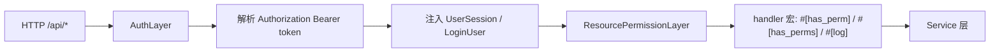

# 认证与资源权限

Summerrs Admin 的认证体系由 `summer-auth` 和 `summer-system` 共同完成。`summer-auth` 负责 JWT、会话和令牌校验,`summer-system` 提供登录、刷新、登出、在线设备、菜单权限和后端 API 资源权限。主应用启动时会注册这些相关插件:

| 插件 | 作用 |
|---|---|
| `summer_auth::SummerAuthPlugin` | 读取 `[auth]` 配置, 注册 `SessionManager` |
| `summer_system::plugins::PermBitmapPlugin` | 从 `sys.menu` 加载权限位图映射 |
| `summer_system::plugins::ResourcePermissionPlugin` | 从 `sys.resource` 和 `sys.action_resource` 加载后端 API 资源权限策略 |
| `summer_plugins::LogBatchCollectorPlugin` | 为 `#[log]` 提供异步批量写日志能力 |

`crates/app/src/router.rs` 会把 `summer-system` 这一组路由挂到 `/api`:

```rust
let api_router =
    summer_system::router_with_layers(grouped.take_group(summer_system::system_group()));

Router::new()
    .nest("/api", api_router)
    .merge(default_router)
```

`summer-system/src/router/mod.rs` 再给整组接口挂上认证层和资源权限层:

```rust
pub fn router_with_layers(router: Router) -> Router {
    let group = crate::system_group();

    router
        .layer(ResourcePermissionLayer::new())
        .layer(AuthLayer::for_group(group))
}
```

请求进入系统接口时,顺序可以理解为:


```mermaid
flowchart LR
    A[HTTP /api/*] --> B[AuthLayer]
    B --> C[解析 Authorization Bearer token]
    C --> D[注入 UserSession / LoginUser]
    D --> E[ResourcePermissionLayer]
    E --> F["handler 宏: #[has_perm] / #[has_perms] / #[log]"]
    F --> G[Service 层]
```

## JWT 配置

开发和生产环境都可以通过 `[auth]` 配置认证参数:

```toml
[auth]
access_timeout = 7200
refresh_timeout = 604800
concurrent_login = true
max_devices = 5
per_request_deny_check = true
is_read_cookie = false
token_name = "Authorization"
token_prefix = "Bearer "
jwt_audience = "summer-admin"
jwt_issuer = "summer-admin"
jwt_algorithm = "HS256"
jwt_secret = "${JWT_SECRET:change-me-in-local-dev}"
```

支持的 JWT 算法来自 `summer-auth/src/config.rs`: `HS256`、`HS384`、`HS512`、`RS256`、`RS384`、`RS512`、`ES256`、`ES384`、`EdDSA`。

HMAC 系列使用 `jwt_secret`; 非对称算法使用 `jwt_private_key` 和 `jwt_public_key` 指向 PEM 文件。默认从 Header 取 token。开启 `is_read_cookie = true` 后会尝试读 Cookie,Cookie 模式建议配合 CSRF 防护一起启用。

## 登录与刷新

系统登录接口在 `summer-system/src/router/auth.rs`:

```rust
#[no_auth]
#[log(module = "认证管理", action = "管理员登录", biz_type = Auth, save_params = false)]
#[post_api("/auth/login")]
pub async fn login(...) -> ApiResult<Json<LoginVo>> { ... }
```

实际访问路径是:

```bash
curl -X POST http://localhost:8080/api/auth/login \
  -H "Content-Type: application/json" \
  -d '{"userName":"Admin","password":"123456"}'
```

`LoginDto` 使用 `#[serde(rename_all = "camelCase")]`,所以字段是 `userName` 和 `password`。返回体中的 `data` 是:

```json
{
  "accessToken": "eyJhbGciOi...",
  "refreshToken": "eyJhbGciOi...",
  "expiresIn": 7200
}
```

登录流程如下:

1. 根据 `sys.user.user_name` 查询用户。
2. 检查账号状态,禁用用户直接拒绝。
3. 用 Argon2 校验密码。
4. 通过 `sys.user_role -> sys.role` 读取角色编码。
5. 通过 `sys.role_menu -> sys.menu` 读取启用的 Button 权限,取 `auth_mark` 作为权限码。
6. 调用 `SessionManager::login` 签发 access/refresh token。
7. 异步写入登录日志。

刷新接口是公开接口:

```rust
#[no_auth]
#[post_api("/auth/refresh")]
pub async fn refresh_token(...) -> ApiResult<Json<LoginVo>> { ... }
```

刷新时会先解析 refresh JWT 拿到用户 ID,再从数据库加载最新角色和权限,最后校验 Redis 中的 refresh key 并轮转新的 refresh token。

## Access 与 Refresh 的职责

Access JWT 是自包含的。`summer-auth/src/token/jwt.rs` 的 `AccessClaims` 包含:

| 字段 | 含义 |
|---|---|
| `sub` | 编码后的登录用户 ID |
| `typ` | `access` |
| `iat` / `exp` | 签发与过期时间 |
| `dev` | 设备类型 |
| `user_name` / `nick_name` | 用户展示信息 |
| `roles` | 角色编码列表 |
| `permissions` | 权限码列表,无位图时使用 |
| `pb` | base64 权限位图,有 `PermissionMap` 时使用 |

Refresh JWT 只保存 `sub`、`typ`、`iat`、`exp` 和 `rid`。`rid` 对应 Redis 中的 `auth:refresh:{rid}`。

Redis 会话 key 主要有三类:

| Key | 内容 |
|---|---|
| `auth:device:{login_id}:{device}` | 设备会话 JSON,包含 refresh `rid`、登录时间、IP、User-Agent |
| `auth:refresh:{rid}` | `login_id:device`,用于 refresh token 轮转校验 |
| `auth:deny:{login_id}` | `banned` 或 `refresh:{timestamp}` |

`max_devices = 5` 时,第 6 个设备登录会清掉最早登录的设备。`concurrent_login = false` 时,新登录会清掉该用户所有旧设备。

## 公开路由

`#[public]` 和 `#[no_auth]` 会在编译期通过 `inventory` 注册公开路由。`AuthLayer::for_group(group)` 启动时会把同一 group 下的公开路由合并到 `PathAuthConfig.exclude`。

系统公开接口包括:

| 路径 | 来源 |
|---|---|
| `POST /api/auth/login` | `#[no_auth]` |
| `POST /api/auth/refresh` | `#[no_auth]` |
| `GET /api/public/file/{token}` | `#[public]` |

其他 `summer-system` 接口默认都需要登录。

如果路由宏无法自动推导公开路径,可以显式写:

```rust
#[public(GET, "/health")]
#[get_api("/health")]
async fn health() -> ApiResult<()> {
    Ok(())
}
```

## Handler 权限宏

多数管理接口在 handler 上使用声明式权限宏:

```rust
#[has_perm("system:user:create")]
#[post_api("/user")]
pub async fn create_user(...) -> ApiResult<()> { ... }

#[has_perms(or("system:role:list", "system:user:create", "system:user:update"))]
#[get_api("/role/list")]
pub async fn list_roles(...) -> ApiResult<Json<Page<RoleVo>>> { ... }
```

权限码来自 `sys.menu` 中 `menu_type = Button` 且 `enabled = true` 的 `auth_mark`。`permission_matches` 支持这些匹配:

| 持有权限 | 可匹配 |
|---|---|
| `system:user:list` | 精确匹配同名权限 |
| `*` | 任意权限 |
| `system:*` | `system:` 下所有权限 |
| `system:*:list` | 中间段通配 |

`PermBitmapPlugin` 启动时从 `sys.menu.bit_position` 加载 `PermissionMap`。映射存在时,登录会把权限列表压缩为 JWT 的 `pb` 字段;映射缺省时,JWT 会保存 `permissions` 数组。位图的价值主要是压缩 token 体积,通配符匹配仍在解码后的权限字符串上完成。

## 后端 API 资源权限

除了 handler 上的 `#[has_perm]`,系统还提供一层后端 API 资源权限:

| 表 | 作用 |
|---|---|
| `sys.resource` | 登记后端 API 资源,包含 method、path、enabled |
| `sys.action_resource` | 把资源绑定到按钮菜单 `sys.menu.id` |
| `sys.menu` | Button 菜单的 `auth_mark` 是最终动作权限 |

`ResourcePermissionPlugin` 启动时加载启用的 `sys.resource`,再查它们绑定的按钮权限,生成内存策略。`SysResourceService` 在创建、更新、启停、删除资源或保存绑定后都会调用 `reload_policy()` 热更新策略。

资源权限层的判定规则很务实:

- 请求尚未注入登录会话时跳过,交给 AuthLayer 或公开路由处理。
- 匹配到已登记资源且绑定了动作权限时,用户只要拥有任意一个绑定权限即可通过。
- 匹配到已登记资源但尚未绑定动作权限时,暂时放行,方便灰度录入资源。
- 未登记资源默认放行,用于兼容旧接口。

因此,生产环境要同时维护两件事: handler 上的 `#[has_perm]` 不能随意缺失,`sys.resource` 与按钮绑定也要逐步补齐。

## 设备与强制下线接口

认证路由还提供设备管理:

| 方法 | 路径 | 说明 |
|---|---|---|
| `POST` | `/api/auth/logout` | 登出本设备 |
| `POST` | `/api/auth/logout/all` | 登出所有设备 |
| `GET` | `/api/auth/sessions` | 查看本用户在线设备 |
| `DELETE` | `/api/auth/sessions/{device}` | 踢下本用户某个设备 |

`online.rs` 提供管理员视角的在线用户管理:

| 方法 | 路径 | 权限 |
|---|---|---|
| `GET` | `/api/online/list` | `system:online:list` |
| `DELETE` | `/api/online/{login_id}` | `system:online:kick` |
| `DELETE` | `/api/online/{login_id}/{device}` | `system:online:kick` |

登出、踢设备和角色权限变更都通过 `auth:deny:{login_id}` 触发旧 access token 刷新。`deny = "refresh:{ts}"` 表示 `iat <= ts` 的旧 token 需要刷新;`deny = "banned"` 表示账号被封禁,access 和 refresh 都拒绝。

## 操作日志

系统路由大量使用 `#[log]`:

```rust
#[log(module = "用户管理", action = "创建用户", biz_type = Create)]
#[has_perm("system:user:create")]
#[post_api("/user")]
pub async fn create_user(...) -> ApiResult<()> { ... }
```

`#[log]` 会注入 `OperationLogContext`,捕获 method、URL、query、User-Agent、客户端 IP、登录会话中的用户和耗时。日志不会在请求主链路同步写库,而是推到 `OperationLogCollector`,由 `LogBatchCollectorPlugin` 批量写入 `sys.operation_log`。

敏感接口应该显式关闭参数或响应记录,例如登录和重置密码使用 `save_params = false`。
