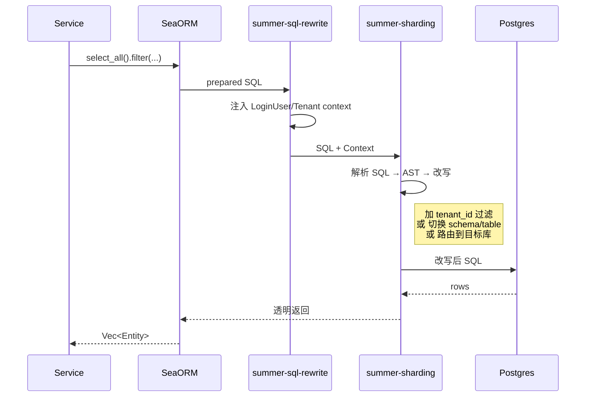

# 多租户与数据隔离

Summerrs Admin 的多租户由两个 crate 协作完成:

| Crate | 角色 |
|---|---|
| `crates/summer-sharding` | 底层 SQL 改写引擎,支持四级隔离、分片、加密、脱敏、CDC |
| `crates/summer-sql-rewrite` | 上层鉴权信息注入(把 `LoginUser` 的租户信息塞进改写 context) |

## 四级隔离模式

| 模式 | 适用场景 | 实现方式 |
|---|---|---|
| **`shared_row`** | 多数 SaaS,租户量大成本敏感 | SQL 改写自动加 `WHERE tenant_id = ?` |
| **`separate_table`** | 中等隔离需求 | `user_001` / `user_002` 物理分表 |
| **`separate_schema`** | 强隔离 + 备份独立 | PostgreSQL schema 隔离 |
| **`separate_database`** | 完全独立的合规要求 | 每个租户独立物理库 |

切换模式只改配置:

```toml
[summer-sharding.tenant]
default_isolation = "shared_row"      # shared_row | separate_table | separate_schema | separate_database
enabled = true
tenant_id_source = "request_extension"  # 从 axum extension 取(由 summer-auth 注入)

[summer-sharding.tenant.row_level]
column_name = "tenant_id"
strategy = "sql_rewrite"   # sql_rewrite | rls
```

`strategy = "rls"` 走 PostgreSQL 行级安全策略(`CREATE POLICY ...`),`sql_rewrite` 走应用层改写。两种都不需要业务代码改动。

## SQL 改写流程



> 业务代码看到的就是普通 SeaORM 调用,**完全不用感知租户**。

## 租户上下文从哪来

`tenant_id_source = "request_extension"` 表示从 axum extension 读。`summer-auth` 在 JWT 鉴权成功后,会把 `TenantContext { tenant_id, isolation, ... }` 塞到 request extension 里。

如果是 `tenant_id_source = "header"`,则从 HTTP header(例如 `X-Tenant-Id`)读,适合 API 网关已经做完租户路由的场景。

## 实体里要不要写 tenant_id 字段?

**要**。表 schema 里物理上有 `tenant_id` 列(对 `shared_row` 模式),SeaORM Entity 也要把这个字段定义出来。改写引擎只是帮你**自动加 WHERE 子句**,而不是凭空创造字段。

```rust
#[derive(Clone, Debug, PartialEq, DeriveEntityModel)]
#[sea_orm(table_name = "sys.user")]
pub struct Model {
    #[sea_orm(primary_key)]
    pub id: i64,

    pub username: String,

    /// 租户 id,改写引擎会自动加过滤
    pub tenant_id: i64,

    /// ... 其他字段
}
```

## 跨租户的工具数据怎么办?

某些表(例如 `sys.dict_type` 字典类型表)所有租户共用,不希望自动注入租户过滤。可以在 `summer-sharding` 配置里把这些表标记为**忽略**:

```toml
[summer-sharding.tenant]
ignore_tables = ["sys.dict_type", "sys.dict_data", "sys.config"]
```

或者在表上不设置 `tenant_id` 列(改写引擎检测到列不存在自动跳过)。

## CDC 管道

`summer-sharding/src/cdc/` 提供基于 PostgreSQL 逻辑复制的变更捕获:

- 从 `pgwire-replication` 读 WAL
- 按租户过滤事件
- 投递到下游(Redis Stream / Kafka / 业务回调)

典型用例:

- 多租户审计日志
- 跨租户的搜索索引同步
- 租户数据迁移(`shared_row` → `separate_database`)

## 加密、脱敏、影子库

`summer-sharding` 还内置:

- **加密**(`encrypt/`)—— 字段级加密,落库前完成,SeaORM Entity 配合 `EncryptedColumn` 标记
- **脱敏**(`masking/`)—— 输出时按规则脱敏(手机号、身份证、邮箱),不动数据库存储
- **影子库**(`shadow/`)—— 压测时把流量复制到镜像数据库
- **审计**(`audit/`)—— 自定义 SqlAuditor 钩子,所有 SQL 都过一遍

这些能力在 `enabled = true` 时自动接入,具体启用哪几项靠子段开关。

## 一键迁移工具

`summer-sharding/src/migration/` 提供从 `shared_row` 升级到 `separate_database` 的工具:

1. 在新库建表
2. 从 CDC 读取目标租户的 WAL,回放到新库
3. 切换路由(`router/`),让该租户的请求落到新库
4. 验证一致后删除旧库的对应租户数据

**这一步在生产环境需要慎重**,推荐先做演练。

## DDL 同步

`summer-sharding/src/ddl/` 处理多租户场景下的 DDL:

- `shared_row` → 一次 DDL 全部租户生效
- `separate_table` → 自动循环为每个租户的物理表执行 DDL
- `separate_schema` → 切换 schema 后逐个执行
- `separate_database` → 配合迁移工具或运维脚本

## 性能开销

| 模式 | 改写开销 | 备注 |
|---|---|---|
| `shared_row`(sql_rewrite) | 几微秒(SQL 解析 + AST 改写) | 大多数业务无感 |
| `shared_row`(rls) | 几乎零(数据库内部) | 但要给每张表建 policy |
| `separate_table` | 单次表名替换 | 仍是一个连接 |
| `separate_schema` | `SET search_path` 一次 | 连接池要按租户分组 |
| `separate_database` | 路由到不同 connection pool | 多池开销,最适合大客户独占 |

## 校验是否生效

启动后跑一个简单测试:

```sql
-- 在 db 里直接看
SELECT pg_stat_activity.query
FROM pg_stat_activity
WHERE state = 'active'
  AND query ILIKE '%sys%user%';
```

会看到改写后的 SQL 末尾自动多了 `AND tenant_id = $N`。

或者打开调试日志:

```toml
[sea-orm]
enable_logging = true
```

```text
DEBUG sea-orm: SQL: SELECT ... FROM "sys"."user" WHERE id = $1 AND tenant_id = $2
```

## 配置文件全貌

```toml
[summer-sharding]
enabled = true

[summer-sharding.tenant]
default_isolation = "shared_row"
enabled = true
tenant_id_source = "request_extension"
# 可选:对哪些表不做租户过滤
# ignore_tables = ["sys.dict_type", "sys.config"]

[summer-sharding.tenant.row_level]
column_name = "tenant_id"
strategy = "sql_rewrite"

# [summer-sharding.encrypt]
# enabled = true
# key_id = "primary"

# [summer-sharding.audit]
# enabled = true
# sink = "log"
```

## 参考源码

- 配置:`crates/summer-sharding/src/config/`
- 租户控制平面:`crates/summer-sharding/src/tenant/{metadata,router,context,rewrite,rls}.rs`
- SQL 改写:`crates/summer-sharding/src/rewrite/`
- 加密:`crates/summer-sharding/src/encrypt/`
- 脱敏:`crates/summer-sharding/src/masking/`
- CDC:`crates/summer-sharding/src/cdc/`
- 迁移工具:`crates/summer-sharding/src/migration/`
- 鉴权信息注入:`crates/summer-sql-rewrite/src/`
