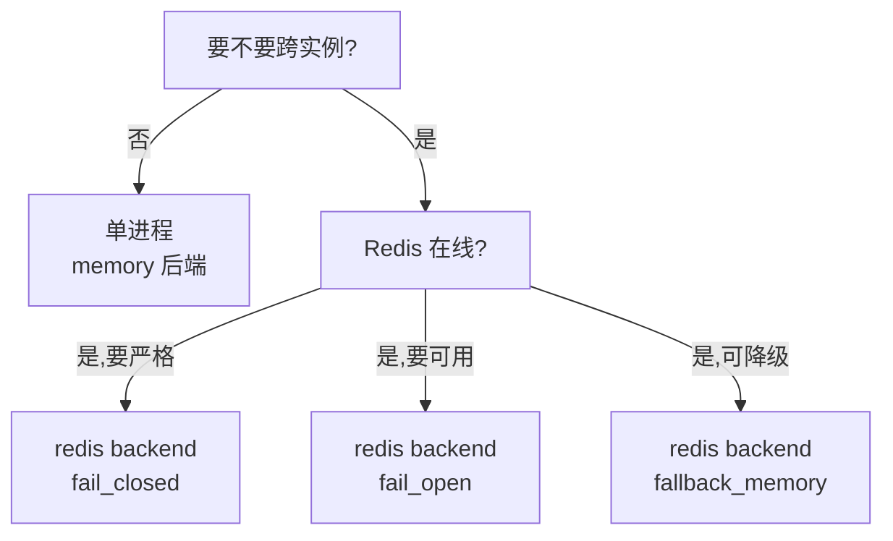

# 限流与日志

声明式宏 `#[rate_limit]` 是 Summerrs Admin 的核心运行时保护。它支持五种算法,内存与 Redis 双后端。底层基于 **GCRA**(Generic Cell Rate Algorithm)——Cloudflare / Stripe / Envoy 都在用的工业标准。

## 算法清单

| `algorithm` | 内核 | 适合 |
|---|---|---|
| `token_bucket`(默认) | GCRA,burst 默认等于 rate | 普通限流,**最常用** |
| `gcra` | 显式 GCRA,自定 burst | 精确控制突发 |
| `leaky_bucket` | 严格按 1/rate 间隔放行 | 想要绝对均匀 |
| `throttle_queue` | 漏桶 + 排队等待 | 不想直接拒,在 `max_wait_ms` 内排队 |
| `fixed_window` | 自然时间窗口对齐计数 | 简单按"每分钟 N 次"计 |
| `sliding_window` | 时间戳日志,最精确 | 占内存,但最准 |

> 推荐先用默认 `token_bucket`,有突发场景再换 `gcra` 显式调 burst。

## 基本用法

`crates/summer-admin-macros/src/lib.rs`:

```rust
use summer_admin_macros::rate_limit;
use summer_common::error::ApiResult;
use summer_web::get_api;

// 单 IP 每秒 2 次
#[rate_limit(rate = 2, per = "second", key = "ip")]
#[get_api("/limited")]
async fn limited_handler() -> ApiResult<()> {
    Ok(())
}

// GCRA + burst:突发允许 10 个,长期速率每秒 1 个
#[rate_limit(rate = 1, per = "second", burst = 10, algorithm = "gcra", key = "ip")]
#[get_api("/api")]
async fn api_handler() -> ApiResult<()> {
    Ok(())
}

// 排队限流:最多排 1.5 秒
#[rate_limit(
    rate = 5, per = "second", key = "user",
    algorithm = "throttle_queue", max_wait_ms = 1500
)]
#[get_api("/queue")]
async fn queue_handler() -> ApiResult<()> {
    Ok(())
}
```

## 参数全集

| 参数 | 默认 | 说明 |
|---|---|---|
| `rate` | **必填** | 每个窗口允许的请求数 |
| `per` | **必填** | `"second"` / `"minute"` / `"hour"` / `"day"` |
| `key` | `"global"` | `"global"` / `"ip"` / `"user"` / `"header:<name>"` |
| `backend` | `"memory"` | `"memory"` / `"redis"` |
| `algorithm` | `"token_bucket"` | 见算法清单 |
| `failure_policy` | `"fail_open"` | `"fail_open"` / `"fail_closed"` / `"fallback_memory"` |
| `burst` | `= rate` | 仅 `token_bucket` / `gcra` |
| `max_wait_ms` | — | 仅 `throttle_queue`,必须 > 0 |
| `message` | `"请求过于频繁"` | 被限流时返回的提示 |

## key 的语义

| key | 实际维度 |
|---|---|
| `"global"` | 所有请求共享同一个桶 |
| `"ip"` | 按客户端 IP(`ip:1.2.3.4`) |
| `"user"` | 按登录用户 id;**未登录回退到 `ip:` 前缀**,不会与 `"ip"` 串号 |
| `"header:X-Tenant-Id"` | 按某个 header 值;header 缺失时用 `unknown` |

## failure_policy

`backend = "redis"` 时,Redis 故障的兜底策略:

| 策略 | 行为 |
|---|---|
| `"fail_open"` | 放行,记录 stats(默认) |
| `"fail_closed"` | 返回 503 |
| `"fallback_memory"` | 跌到本地内存桶,**多实例下语义降级**(每实例独立计数) |

生产场景的取舍:

- **更看重可用性** → `fail_open`(挂了 Redis 也别让用户感知)
- **更看重准确性** → `fail_closed`(宁可 503 也不放过去)
- **能接受单进程隔离** → `fallback_memory`

## 前置条件

`#[rate_limit]` 需要在应用里有一个 `RateLimitEngine` 组件:

```rust
// 方式 1:axum layer
router.layer(Extension(RateLimitEngine::new(...)));

// 方式 2:summer 组件
app.add_component(RateLimitEngine::new(...));
```

通常框架已经在 `summer-common` 或对应插件里准备好了,业务侧不用关心。

## 内核细节:GCRA 是怎么工作的

```text
TAT(Theoretical Arrival Time)= 上次请求到达时间 + 1/rate

来一个请求时:
  if now >= TAT - burst*1/rate:
    放行,TAT = max(now, TAT) + 1/rate
  else:
    拒绝(或排队等待)
```

只用 1 个时间戳就能表达"长期速率 + 突发容量",**O(1) 内存**,Cloudflare 用它扛过亿 QPS。

## 限流命中后的响应

```http
HTTP/1.1 429 Too Many Requests
Content-Type: application/json
Retry-After: 1

{
  "code": 429,
  "message": "请求过于频繁"
}
```

`Retry-After` 是建议等待秒数(GCRA 能精确算)。

## 复合用法

```rust
// 同时挂登录校验、权限校验、限流、日志
#[has_perm("ai:relay:chat")]
#[rate_limit(rate = 60, per = "minute", key = "user", backend = "redis")]
#[log(module = "AI 网关", action = "chat completion", biz_type = Other, save_response = false)]
#[post_api("/v1/chat/completions")]
async fn chat_completions(...) -> ApiResult<...> { ... }
```

宏的展开顺序是从下往上,所以先校验权限,再走限流,最后记日志。日志记录的是真实命中后的耗时(限流拒掉的请求也会被日志感知,看 `status_code`)。

## 操作日志 `#[log]`

`#[log]` 把每次请求记录成一条 `sys.operation_log`,字段:

| 字段 | 来源 |
|---|---|
| `module` | 宏参数 |
| `action` | 宏参数 |
| `biz_type` | 宏参数(`Create` / `Update` / `Delete` / `Query` / `Auth` / ...) |
| `request_method` | HTTP 方法 |
| `request_path` | 路由 path |
| `request_params` | 请求 body / query(可关闭) |
| `response_body` | 响应内容(可关闭,大响应建议关) |
| `oper_user_id` / `oper_user_name` | 当前登录用户 |
| `oper_ip` / `oper_location` | IP + IP2Region 地理位置 |
| `oper_ua` | User-Agent |
| `cost_ms` | 耗时 |
| `status` | 成功 / 失败 |
| `error_message` | 失败信息(如有) |

## 批量写入:为什么不直接写库

`#[log]` 不会同步写 `sys.operation_log`(那样会拖慢主请求 5-30ms)。它把记录扔进一个 channel,`LogBatchCollectorPlugin` 在后台:

```toml
[log-batch]
batch_size = 100      # 攒够 100 条或定时 flush
```

这样:

- **主链路无阻塞** —— 写日志只走 channel.send (微秒级)
- **数据库压力可控** —— 每秒最多几次批量 INSERT,而不是几千次单条
- **失败兜底** —— channel 满了会降级到同步写或丢弃(看策略)

## 操作日志的查询

```bash
# 后台 API
GET /api/operation-log?module=AI 网关&page=1&size=20
GET /api/login-log?username=Admin

# 数据库直接查
SELECT module, action, oper_user_name, cost_ms, status, oper_time
FROM sys.operation_log
WHERE oper_time > now() - interval '1 day'
ORDER BY oper_time DESC
LIMIT 100;
```

## 限流后端选择决策



## 性能开销

| 后端 | 单次检查 |
|---|---|
| `memory`(moka 缓存 + GCRA) | < 1μs |
| `redis`(单 Lua 脚本) | 0.5ms - 2ms(看网络) |

`memory` 桶用 `moka::sync::Cache` 自动 GC,无内存膨胀。

## 参考源码

- 宏定义:`crates/summer-admin-macros/src/lib.rs`(第 146 行起)
- 宏展开:`crates/summer-admin-macros/src/rate_limit_macro.rs`
- `RateLimitEngine`:`crates/summer-common/src/rate_limit/`(具体路径以仓库实际为准)
- 日志宏:`crates/summer-admin-macros/src/log_macro.rs`
- 批量日志收集:`crates/summer-plugins/src/log_batch_collector/`
