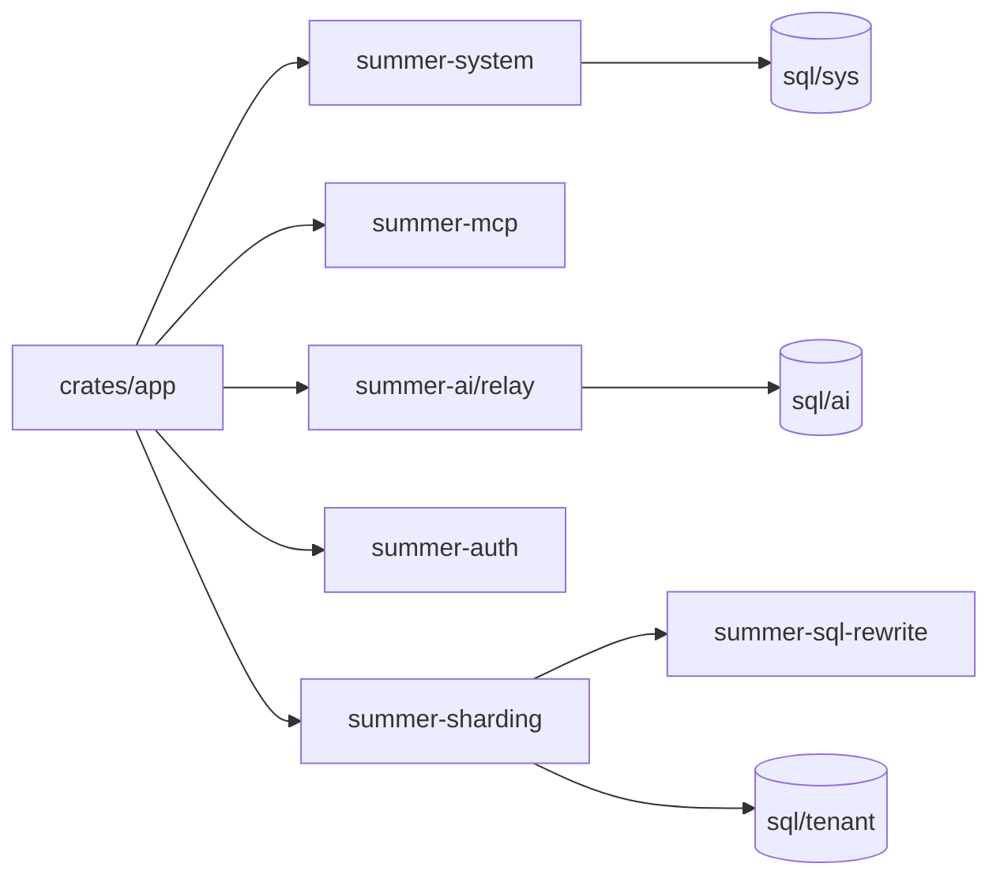

# 模块概览

这一页不展开所有实现细节，只帮助你在进入代码之前先建立工作区地图。

## 顶层目录怎么理解

从当前仓库结构看，最值得优先建立认知的是这几块：

```tree
summerrs-admin
├── config
│   ├── app-dev.toml
│   ├── app-prod.toml
│   └── app-test.toml
├── crates
│   ├── app
│   ├── summer-system
│   ├── summer-mcp
│   ├── summer-ai
│   ├── summer-sharding
│   └── summer-sql-rewrite
├── docs
├── locales
└── sql
    ├── ai
    ├── migration
    ├── sys
    └── tenant
```

- `crates/`
  主要业务代码都在这里，按模块拆成多个 crate
- `config/`
  运行时配置入口，开发环境最先看 `app-dev.toml`
- `sql/`
  数据库结构与种子数据的 source of truth
- `docs/`
  仓库内部的设计说明、迁移记录和调研文档
- `locales/`
  i18n 文案资源

## 最先会碰到的核心 crate

### `crates/app`

主应用入口。这里把 Web、数据库、Redis、鉴权、MCP、AI Relay、分片、SQL 重写、对象存储等插件统一装配起来，是本地启动时的第一入口。



### `crates/summer-system`

系统域后台接口与业务逻辑，当前已经覆盖：

- 认证与会话
- 用户、角色、菜单、字典、配置
- 文件与文件夹
- 登录日志、操作日志、通知
- 在线用户、缓存监控、服务器监控
- 一部分租户控制面接口

如果你启动后最先验证的是 `/api/auth/login`、`/api/user/info`、`/api/docs`，本质上都在和这个 crate 打交道。

### `crates/summer-mcp`

MCP Server 的核心实现。当前仓库里能确认到的能力包括：

- 表结构发现
- 通用表级 CRUD 工具
- 只读 SQL 与显式 SQL 工具
- SeaORM Entity 生成
- 后端 CRUD 模块生成
- 前端 API / 页面 bundle 生成
- 菜单与字典业务工具

它既能以 embedded 方式挂在主应用里，也能以 `summerrs-mcp` 二进制独立运行。

### `crates/summer-ai`

这一组 crate 主要负责 AI 相关能力，按职责继续拆成：

- `core`
- `model`
- `relay`
- `admin`
- `billing`

从代码上已经能看到 OpenAI 兼容入口、AI 管理接口、路由、计费和平台模型等内容，适合后续继续扩展 AI 控制面。

### `crates/summer-sharding`

负责多租户隔离、数据源路由、CDC、迁移编排、分片与性能相关能力。它和 `summer-sql-rewrite` 一起，为后续更复杂的租户和数据隔离策略提供基础设施。

### `crates/summer-sql-rewrite`

负责 SQL 重写与上下文注入，当前更多是给租户隔离和查询层扩展提供支持。

### 其他常用基础 crate

- `crates/summer-auth`
  认证、token、会话与权限位图相关能力
- `crates/summer-common`
  通用响应、错误、限流、提取器等基础设施
- `crates/summer-domain`
  领域层通用模型与能力
- `crates/summer-plugins`
  S3、IP2Region、后台任务、日志采集等通用插件

## `sql/` 目录和运行时能力的关系

当前 `sql/` 目录按业务域拆分，和 crate 之间大体能对应起来：

- `sql/sys/`
  对应系统域基础表和种子数据，最适合先导入
- `sql/tenant/`
  对应租户控制面相关表
- `sql/ai/`
  对应 AI relay / gateway / control-plane 相关表
- `sql/migration/`
  历史迁移和一次性修复脚本

如果你现在只是先验证后台认证与 OpenAPI，优先导入 `sql/sys/` 即可；如果要继续走 AI 或租户相关能力，再补其余目录。

## 先从哪里读代码最省力

如果你已经完成本地启动，我建议按照下面的顺序继续深入：

1. `crates/app/src/main.rs`
   先看主应用把哪些插件装起来
2. `crates/summer-system/src/router/`
   再看系统域都暴露了哪些接口
3. `crates/summer-mcp/src/`
   然后理解嵌入式 MCP 和 standalone MCP 的关系
4. `config/app-dev.toml`
   最后回头对照运行时配置，把路径、端口和依赖串起来

## 下一步建议

如果你已经确定后续会重点使用 MCP，可以继续从 API 区的 [概览](/api/) 看起；如果你准备继续补文档或扩展某个业务模块，就从对应 crate 的 `router`、`service` 和 `model/sql` 对照阅读。
